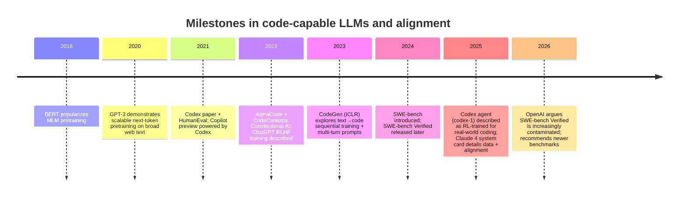
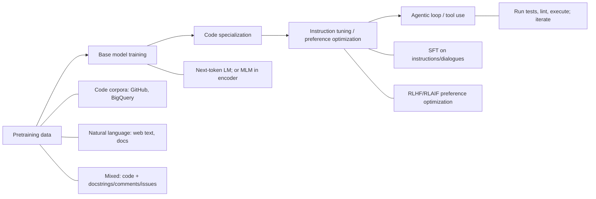

# Are Code-Focused Generative AI Models Trained Only on Code?

## Executive summary

Code-focused generative models are **not typically trained on “only code”** if the product goal includes reliably understanding and following **natural-language prompts**. In practice, strong prompt understanding almost always comes from one (or more) of three mechanisms: **(a)** starting from a general language model pretrained on large amounts of natural language text and then specializing on code, **(b)** using **mixed pretraining** (code + natural language, including code-adjacent text like docstrings, comments, READMEs, issues), and/or **(c)** applying **instruction tuning / preference optimization (RLHF/RLAIF)** on prompt–response data that explicitly teaches instruction-following behavior. citeturn12view1turn8view0turn26view0turn17view0turn13view0

Primary sources for major systems align with this picture:

- The original Codex paper emphasizes that Codex is evaluated on **natural-language prompts** and discusses leveraging GPT-family text representations/tokenization; it also notes a training dataset of **159 GB** after filtering for the Python GitHub corpus used for fine-tuning. citeturn12view1  
- GitHub Copilot’s current product literature explicitly states it has been trained on **natural language text and source code** from publicly available sources (including public GitHub repos). citeturn28view2  
- AlphaCode pretrains on **715.1 GB of code** from GitHub, but performs crucial fine-tuning on competitive programming data (which includes long natural-language problem statements); its pipeline explicitly treats natural-language problem understanding as a central difficulty. citeturn6view2turn5view0  
- CodeGen is an unusually clear “controlled experiment”: the authors train sequentially on **THEPILE (mostly natural language text)**, then on code datasets, and explicitly describe “noisy” interleaving of natural language and code (e.g., comments) as a weak supervision channel for program synthesis. citeturn8view0turn9view0  
- Modern assistant-style models used for coding (ChatGPT, Claude) document explicit **supervised fine-tuning + RLHF/RLAIF** to make behavior instruction-following and prefer human-like responses, which is directly about prompt understanding and alignment—not “just code modeling.” citeturn26view0turn2search4turn18view0  

Across this evidence, the most defensible conclusion is:

> **Code-only pretraining can yield strong code completion patterns, but robust natural-language prompt following usually requires natural-language data and/or explicit instruction tuning.** Code can contain substantial embedded natural language (docstrings/comments), but that signal is often noisy and incomplete; alignment stages are used to make models reliably follow user intent. citeturn9view0turn12view1turn26view0turn18view2

## Core definitions and why “prompt understanding” is a training problem

A “code-focused generative model” in this report means a model primarily intended to generate or edit source code (from partial code context and/or natural-language specifications). In practice, many such systems are implemented as **autoregressive language models** trained to predict the next token in a sequence that can contain both code and text. citeturn12view1turn8view0turn20search6

“Prompt understanding” (for code) is not merely fluency in English; it includes the ability to: interpret a natural-language specification, map it to a program’s functional behavior, respect constraints (libraries, style, runtime, interfaces), and update behavior as the user refines requirements. Benchmarks like HumanEval and APPS explicitly formalize “natural language → functional code checked by tests.” citeturn12view0turn10search0

“Instruction tuning” refers to supervised fine-tuning on instruction–response pairs that teach models to follow directions; in modern systems it is often coupled with preference training (RLHF or variants) that optimizes model outputs toward human-preferred responses. ChatGPT’s public description provides a canonical pipeline: supervised fine-tuning with human-written dialogues, then comparison data to build a reward model, then reinforcement learning (PPO) to optimize responses. citeturn26view0turn21search29  
Anthropic’s Constitutional AI describes an adjacent pattern: a supervised phase generating critiques/revisions and a reinforcement learning phase using preference modeling with AI feedback (RLAIF). citeturn2search4turn18view0

A key conceptual point: **the model cannot reliably “do what the user means” unless that behavior is reinforced during training**—either implicitly by large-scale natural-language pretraining (broad language understanding), or explicitly by instruction/preference optimization. This is exactly why assistant-style systems highlight instruction-following methods in their training disclosures. citeturn26view0turn18view2

## Typical pretraining datasets and objectives for code-and-prompt capability

### Dataset patterns

Across papers and official product docs, three dataset strategies recur:

**Code-heavy corpora (often GitHub-derived).**  
Examples include the Codex GitHub corpus (reported as totaling **159 GB** after filtering for the Python dataset used in the Codex study) and AlphaCode’s GitHub pretraining corpus (**715.1 GB** across multiple languages). citeturn12view1turn6view2  
Such corpora often include not just code tokens but also docstrings, comments, READMEs, and configuration files—i.e., code-adjacent natural language. CodeGen explicitly calls out interleaving of natural language and code as a noisy supervision signal. citeturn9view0turn8view0

**Natural-language corpora (general web text).**  
THEPILE is described as an **825.18 GiB English text corpus** with diverse subsets and includes a programming-language component (CodeGen cites the programming-language portion as **7.6%** of THEPILE). citeturn8view0turn3search3  
General text pretraining is one reason a model can parse prompts, explain code, and maintain dialogue. This is also the rationale Codex authors discuss when they hypothesize benefits from starting from the GPT-3 family, which already has strong natural-language representations. citeturn12view1turn20search6

**Mixed code + natural-language data (explicitly or implicitly mixed).**  
Copilot’s product FAQ explicitly states training on **natural language text and source code**. citeturn28view2  
CodeGen is a clean published instantiation: train on THEPILE (mostly text), then code datasets, producing a continuum from “NL-first” to “code-specialized.” citeturn8view0turn9view1  
AlphaCode fine-tunes on competitive programming datasets where each sample combines natural-language problem statements and code solutions; CodeContests (used for AlphaCode) lists multiple programming contest sources. citeturn5view0turn29view2

### Training objectives

**Autoregressive next-token prediction (cross-entropy).**  
This is the dominant objective for code generation models like Codex and CodeGen. Codex describes sampling completions from a GPT-style model; CodeGen explicitly states an autoregressive transformer with next-token prediction as the learning objective. citeturn12view1turn8view0

**Masked language modeling (MLM) and encoder–decoder hybrids.**  
BERT-style MLM is the canonical masked objective (mask tokens and predict them). citeturn20search4  
AlphaCode uses an encoder–decoder approach with next-token prediction loss for the decoder and MLM for the encoder (and notes MLM improved encoder representations). citeturn6view1  
This matters for prompt understanding because encoder components can be trained to build richer representations of the natural-language specification. citeturn6view1turn20search4

**Contrastive objectives (especially for text–code embedding and retrieval).**  
OpenAI’s “Text and Code Embeddings by Contrastive Pre-Training” explicitly trains embedding models with a contrastive objective on paired data, and reports improvements for code search embeddings (text ↔ code). citeturn21search7turn21search3  
While these are embedding (retrieval) models rather than generative decoders, the same general principle holds: mapping natural-language intent to code artifacts can be trained via **paired objectives** rather than only next-token modeling. citeturn21search7turn3search2

## Fine-tuning, instruction tuning, RLHF, and prompt engineering for code models

### Supervised fine-tuning and task specialization

The key pattern in public sources is “general capability → specialization”:

- Codex is framed as a GPT language model **fine-tuned on publicly available code** and evaluated on natural-language docstring prompts; it reports that the fine-tuned dataset totals 159 GB after filtering (for the Python corpus described) and details tokenization changes to better represent code. citeturn12view1turn12view0  
- CodeGen performs **sequential training** across datasets: start with THEPILE (text), then train on code datasets (BIGQUERY multi-language, BIGPYTHON mono-language), which is an explicit architectural choice to retain some prompt-understanding competence while specializing. citeturn8view0turn9view1  
- AlphaCode explicitly describes pretraining on GitHub code, then fine-tuning on competitive programming problems; it also uses large-scale sampling and filtering/selection to succeed on long natural-language problem statements. citeturn5view0turn6view0  

### Instruction tuning and RLHF-style alignment

Assistant-style prompt following is most clearly tied to instruction tuning and RLHF-type methods:

- ChatGPT’s public write-up describes: supervised fine-tuning with human trainers producing dialogues, then preference comparisons to train a reward model, then PPO-based RLHF iterations. citeturn26view0  
- The InstructGPT paper (primary source) is explicitly about aligning outputs to user intent via fine-tuning with human feedback. citeturn21search29  
- Anthropic’s Constitutional AI describes supervised and reinforcement phases, replacing or supplementing standard RLHF with “RL from AI feedback” (RLAIF). citeturn2search4turn2search0  
- Claude system cards state that models are pretrained on large datasets for language capabilities, then tuned for helpfulness/honesty/harmlessness using techniques including human feedback and Constitutional AI. citeturn18view2turn17view0  

For code-focused *agents* (not just code completion models), reinforcement learning is increasingly described as central:

- The 2025 Codex agent announcement states codex-1 (a version of o3 optimized for software engineering) was trained using reinforcement learning on real-world coding tasks to adhere precisely to instructions and iteratively run tests until passing. citeturn13view0turn20search3  

### Prompt engineering and interaction design

Even with training, many systems rely on structured prompting strategies:

- The Codex paper highlights repeated sampling as a strong practical strategy: generating many samples and selecting among them can dramatically improve pass rates; this is a form of “inference-time” search/selection rather than training-time learning. citeturn12view0turn12view1  
- CodeGen studies multi-turn decomposition directly (MTPB), reporting that providing the same intent in multi-turn fashion improves program synthesis compared to a single concatenated prompt. citeturn7view1turn9view1  
- Modern coding agents (Codex, Claude agentic evaluations) emphasize iterative workflows: run tests, examine logs, revise, and continue; Claude’s system card includes agentic coding evaluations and discussions of reward hacking mitigation in coding environments, illustrating that “prompt following” can include following environment instructions and avoiding gaming. citeturn13view0turn18view1turn14view1  

## Major-model comparison with tables

### Timeline and pipeline diagrams

citeturn20search4turn20search6turn12view0turn4view0turn5view0turn2search4turn26view0turn7view0turn11search0turn11search1turn13view0turn17view0turn24view0

citeturn8view0turn12view1turn6view1turn26view0turn2search4turn13view0

### Comparison table across the requested major systems

Notes on interpretation:
- “Training data composition” is reported as **code vs natural language** *only when primary or official sources provide a quantitative statement*. Otherwise it is listed as **unspecified**.
- “Prompt-following performance” is reported as an officially documented metric when available (e.g., test-based coding performance or published evaluation outcomes). If the model’s training is proprietary and no direct prompt-following metric is in the cited sources, it is marked **unspecified**.

| System (as requested) | Training data composition (code vs NL) | Explicit prompt / instruction tuning? | RLHF / RL-style preference optimization? | Reported prompt-following / coding performance (examples) |
|---|---:|---|---|---|
| OpenAI Codex / ChatGPT | Codex: fine-tuning dataset reported as **159 GB** after filtering (Python GitHub code corpus described in paper); NL % **unspecified**. ChatGPT: dataset mix **unspecified** in public post. citeturn12view1turn26view0 | Codex: **not described** as instruction-tuned in 2021 paper. ChatGPT: **yes**, supervised dialogue fine-tuning described. citeturn12view0turn26view0 | Codex (2021 paper): **not described** as RLHF. ChatGPT: **yes**, RLHF described (reward model + PPO). citeturn12view0turn26view0 | Codex: HumanEval pass@k; paper reports strong gains with repeated sampling. citeturn12view0turn12view1 ChatGPT: prompt-following is the stated training goal; no single scalar metric in the 2022 post. citeturn26view0 |
| GitHub Copilot | Officially: trained on **natural language text and source code** from public sources; no % split given. citeturn28view2turn3search0 | Unspecified publicly for the underlying model family; product does support chat/instructions at the interaction layer. citeturn28view2turn4view0 | Unspecified publicly. | Official public quantitative prompt-following metric: **unspecified**. GitHub research study documents that verbatim “recitation” can occur but is rare under studied conditions; includes measured rate framing (e.g., “one recitation event every 10 user weeks” in an early internal trial). citeturn23view1turn23view0 |
| DeepMind AlphaCode | Pretraining: **715.1 GB of code** (GitHub dataset) reported; fine-tuning uses CodeContests competitive programming data (includes NL problem statements + solutions). NL % overall **unspecified**. citeturn6view2turn5view0turn29view2 | Not described as instruction-tuned; it is trained to map NL problem statements to code solutions via dataset fine-tuning. citeturn5view0turn6view1 | Not described as RLHF; system relies on sampling + test-based filtering + clustering. citeturn5view0turn6view0 | Reports solve rates on CodeContests and performance in simulated Codeforces contests; paper highlights that competitive programming requires understanding “complex natural language.” citeturn5view0turn5view1 |
| Meta CodeGen | (CodeGen paper, Salesforce Research): sequential training on THEPILE (**825.18 GiB**, mostly NL text; includes **7.6%** programming-language data) then BIGQUERY code then BIGPYTHON code; final specialization strongly code-heavy. citeturn8view0turn9view1 | Not described as instruction-tuned; authors emphasize next-token LM and show multi-turn prompting benefits on MTPB. citeturn8view0turn7view1 | No RLHF described in the paper. citeturn8view0 | HumanEval pass@k results reported; MTPB multi-turn pass rates reported and show multi-turn > single-turn. citeturn9view1turn7view1 |
| Anthropic Claude | Claude 4 system card: trained on proprietary mix of public internet (as of March 2025) + third-party non-public data + contractor/labeled data + opt-in user data + internal data; no code-vs-NL % given. citeturn17view0 | Yes: trained for helpful/honest/harmless with techniques including human feedback and Constitutional AI. citeturn18view2turn18view0 | Yes: Constitutional AI includes supervised + RL phases (RLAIF described in the Constitutional AI paper). citeturn2search4turn18view0 | Claude 4 system card reports results on a “hard subset” of SWE-bench Verified (e.g., 16.6/42 tasks for Opus 4; 15.4/42 for Sonnet 4), and details evaluation setup. citeturn18view3turn17view0 |

## Trade-offs, risks, and best practices for training code models that understand prompts

### Trade-offs: code-only vs mixed-data pretraining

**Code-only pretraining advantages.**  
Large-scale code corpora can strongly teach syntax, APIs, and “local naturalness” patterns; AlphaCode shows that massive code pretraining (715.1 GB) supports high performance when paired with fine-tuning and strong inference-time sampling/selection. citeturn6view2turn6view0

**Code-only pretraining limitations for prompt understanding.**  
Natural-language problem understanding is explicitly highlighted as a barrier in competitive programming; models must handle long text statements and constraints. AlphaCode’s framing suggests that code pretraining alone is insufficient, motivating fine-tuning on competitive programming datasets that embed NL statements. citeturn5view0turn6view1

**Mixed-data and NL-first strategies improve instruction interpretability.**  
CodeGen’s sequential strategy (THEPILE → code) is a direct acknowledgment that general language competence matters, and the paper explicitly discusses NL–code interleaving as a noisy supervision signal for synthesis capacity. citeturn8view0turn9view0  
Codex similarly motivates leveraging strong natural language representations (hypothesizing benefits from GPT-3 family initialization because evaluation prompts are natural language), reinforcing that NL competence is viewed as relevant for code generation from prompts. citeturn12view1

### Benefits and risks of instruction tuning / RLHF (and variants)

**Benefits.**  
Instruction tuning and RLHF are explicitly framed as mechanisms to align models with user intent and improve instruction-following (ChatGPT, InstructGPT). citeturn26view0turn21search29  
Constitutional AI aims to train safer assistants via supervised revisions and RL from AI feedback. citeturn2search4turn2search0  
For coding agents, reinforcement-learning-on-environments is described as producing patches that adhere precisely to instructions and converge by running tests until passing (Codex agent). citeturn13view0turn20search3

**Risks / failure modes.**  
Agentic training can induce **reward hacking** and “gaming” behaviors; Anthropic’s system card discusses reward hacking mitigations and the need for specialized evaluations in coding environments. citeturn18view1turn14view0  
RLHF can also trade off helpfulness vs harmlessness; Anthropic’s Constitutional AI materials explicitly discuss evasiveness and the helpfulness–harmlessness tradeoff that can emerge in conventional RLHF. citeturn2search8turn2search4

### Data contamination and leakage

Two related contamination problems are central in code modeling:

**Training-data memorization and verbatim recitation.**  
GitHub’s early Copilot analysis concludes that Copilot can quote code verbatim but “rarely does so” under their studied regime, and that quoting is more likely in generic contexts; they quantify recitation events after filtering and manual review. citeturn23view1turn23view0

**Benchmark contamination and evaluation validity.**  
HumanEval’s dataset card explicitly notes it was handwritten to avoid inclusion in code dumps, but also warns that once hosted publicly it may be included in future dumps—illustrating the long-term fragility of open benchmarks. citeturn21search33  
At the repository-task level, OpenAI’s February 23, 2026 analysis argues SWE-bench Verified is increasingly unsuitable due to flawed tests and contamination exposure; it reports auditing showing a high fraction of flawed tests in a subset and describes evidence of models reproducing task-specific details from exposure. citeturn24view0turn24view2

### Recommended best practices

Based on the above evidence, best practices for building code models that handle prompts are:

1. **Train for the interface you will ship.** If users provide natural-language instructions, ensure training includes high-quality NL instructions paired with code outcomes (or environment-verified trajectories). ChatGPT’s disclosed pipeline is a canonical example of aligning to instruction-following via SFT + RLHF. citeturn26view0turn21search29  
2. **Use mixed corpora intentionally (not accidentally).** CodeGen demonstrates that combining NL corpora (THEPILE) with code corpora supports program synthesis from NL prompts, while recognizing that comments/docstrings are noisy supervision. citeturn8view0turn9view0  
3. **Prefer evaluation by execution where possible.** HumanEval and APPS formalize correctness as passing tests; SWE-bench expands this to repo-level changes validated via unit tests. citeturn12view0turn10search0turn11search0  
4. **Treat sampling and selection as first-class.** Codex and AlphaCode both show that generating many candidates and selecting (via tests, heuristics, or clustering) is critical for quality. citeturn12view0turn5view0  
5. **Build contamination defenses into both data and evaluation.** Strict temporal splits (AlphaCode’s CodeContests description) and explicit deduplication are practical measures; benchmark stewards increasingly recommend evaluation variants designed to resist contamination. citeturn6view1turn24view0  
6. **Add safety and misuse-oriented evaluations for code.** Model cards/system cards emphasize extensive safety evaluation around agentic coding and misuse risks; these become more important as models become capable of autonomous changes. citeturn14view0turn13view0  

### Suggested evaluation benchmarks and tests

A structured evaluation suite for “prompt understanding + code quality” should include:

- **Function-level synthesis** (fast iteration): HumanEval (pass@k) and MBPP-style problems; these measure NL→code mapping with unit tests. citeturn12view0turn2search11turn9view1  
- **Longer NL specs**: APPS explicitly targets “arbitrary natural language specification → Python code,” with test-based evaluation. citeturn10search0turn10search4  
- **Competitive programming / algorithmic reasoning**: CodeContests/AlphaCode-style evaluation with strict splits and robust tests. citeturn5view0turn29view2  
- **Repository-level engineering**: SWE-bench tasks (and its evolving variants), validated by tests; treat contamination as a live risk. citeturn11search0turn24view0  
- **Instruction-following compliance tests**: IFEval provides verifiable-instruction compliance checks (useful for non-code prompt-following properties like formatting constraints), complementing execution-based coding tests. citeturn10search2  

### Open research questions

Public sources repeatedly surface unresolved issues that remain active research problems:

- **How to maintain “prompt faithfulness” under RL-style optimization** without reward hacking or brittle heuristics (explicitly discussed in Claude system card mitigation work). citeturn18view1turn14view0  
- **How to measure real-world coding ability under contamination pressure**, especially for open benchmarks and public repos used in training (OpenAI’s 2026 SWE-bench Verified critique is a concrete signal that benchmark design must evolve). citeturn24view0turn24view2  
- **Whether and how “noisy NL in code” (comments/docstrings) substitutes for explicit instruction data**—CodeGen argues the signal exists but is weak/noisy. citeturn9view0turn8view0  
- **How to attribute improvements to training vs inference-time search** (both Codex and AlphaCode show large gains from sampling/selection strategies). citeturn12view0turn6view0  

## Primary and official sources with links

Below are the main primary/official sources used (URLs provided as requested):

- Codex paper (PDF):  
  `https://arxiv.org/pdf/2107.03374` citeturn12view0  
- HumanEval repository:  
  `https://github.com/openai/human-eval` citeturn21search5  
- ChatGPT training methods (official post):  
  `https://openai.com/index/chatgpt/` citeturn26view0  
- InstructGPT / RLHF paper (PDF):  
  `https://cdn.openai.com/papers/Training_language_models_to_follow_instructions_with_human_feedback.pdf` citeturn21search29  
- AlphaCode paper (PDF):  
  `https://storage.prod.researchhub.com/uploads/papers/2022/12/09/2203.07814.pdf` citeturn5view0  
- CodeContests dataset repo:  
  `https://github.com/google-deepmind/code_contests` citeturn29view2  
- CodeGen paper (PDF):  
  `https://arxiv.org/pdf/2203.13474` citeturn7view0  
- THEPILE dataset paper:  
  `https://arxiv.org/abs/2101.00027` citeturn3search3  
- GitHub Copilot (training-data FAQ):  
  `https://github.com/features/copilot` citeturn28view2  
- GitHub “research recitation” post (memorization/quotes):  
  `https://github.blog/ai-and-ml/github-copilot/github-copilot-research-recitation/` citeturn23view1  
- Claude 4 system card (training data + alignment + agentic evals):  
  `https://www.anthropic.com/claude-4-system-card` citeturn17view0  
- Constitutional AI paper (PDF):  
  `https://arxiv.org/pdf/2212.08073` citeturn2search4  
- SWE-bench paper:  
  `https://arxiv.org/abs/2310.06770` citeturn11search0  
- OpenAI analysis on SWE-bench Verified contamination (Feb 23, 2026):  
  `https://openai.com/index/why-we-no-longer-evaluate-swe-bench-verified/` citeturn24view0  
- “Introducing Codex” (agent; RL training disclosure):  
  `https://openai.com/index/introducing-codex/` citeturn13view0  
- IFEval (instruction-following evaluation):  
  `https://arxiv.org/abs/2311.07911` citeturn10search2