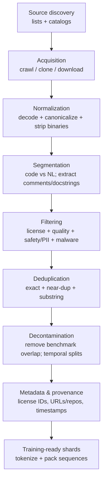
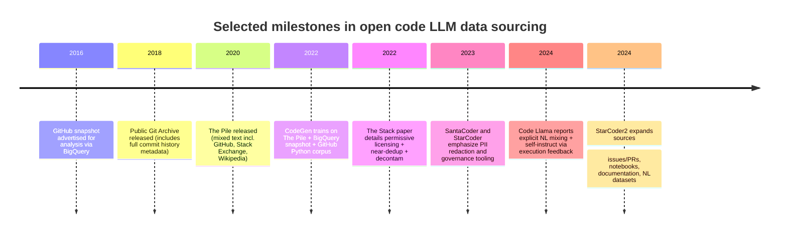

# How Open-Source Code LLMs Obtain Training Data for Natural-Language Prompt Understanding

## Executive summary

Open-source code-focused large language models (code LLMs) generally acquire natural-language (NL) prompt understanding through a *blend* of data types rather than “code only.” The dominant pattern is: (a) broad NL pretraining (often via public web-text mixtures such as The Pile or base-model pretraining that already included web text), (b) “code-adjacent NL” embedded inside code repositories (comments, docstrings, READMEs, notebooks, documentation), and (c) explicit instruction/prompt tuning using human-authored or synthetically generated instruction–response pairs. citeturn9view0turn3view0turn4view1turn11view0turn11view1

In practice, many projects avoid crawling everything themselves and instead rely on (or imitate) a small set of repeatable acquisition channels: public web crawl corpora (notably via entity["organization","Common Crawl","web crawl nonprofit"] WARC/WET artifacts), official dumps (e.g., Wikipedia, Stack Exchange), large-scale Git hosting snapshots (e.g., Google’s BigQuery-hosted GitHub snapshot), and curated “foundation datasets for code” such as The Stack (BigCode) and CodeSearchNet. citeturn9view0turn16view0turn20view0turn18view3turn14search9

Because code corpora are extremely duplication-heavy and benchmarks are easily contaminated, modern open projects increasingly treat deduplication and decontamination as first-class steps (e.g., MinHash-based near-dedup with explicit similarity thresholds; prompt-string matching to remove HumanEval/MBPP leakage). citeturn20view0turn18view2turn3view2

Legally, the story differs sharply by source: web crawls come with weak or ambiguous reuse rights (Common Crawl explicitly does **not** grant copyright licenses to the underlying pages), while Wikipedia and Stack Exchange content are under Creative Commons share-alike licenses that impose attribution (and, for adaptations, share-alike obligations). Code datasets mined from Git hosts inherit the original repository licenses, motivating permissive-license filtering and provenance tooling in projects like BigCode’s The Stack. citeturn1search1turn1search5turn1search14turn20view0turn11view2

## Scope and definitions

This report focuses on **open-source or openly released code LLM projects** and how they obtain *NL/prompt* data (not only code) to make models usable via natural-language instructions. It emphasizes primary sources: papers, dataset/model cards, and official project documentation. citeturn3view0turn4view1turn18view0turn11view2turn10view1

**Natural-language / prompt understanding data (for code models)** in practice includes at least four categories:

1. **General NL corpora** (encyclopedic text, web pages, books, forums) that teach language competence and instruction-like patterns. citeturn9view0turn3view0turn4view1  
2. **Code-adjacent NL** inside software artifacts: comments/docstrings, READMEs, tutorials, notebooks, and documentation files. citeturn3view0turn11view2turn3view3turn11view0  
3. **Technical discussions and Q&A** (Stack Exchange, GitHub issues/PRs) that contain *question → explanation/code* structures resembling prompts. citeturn9view0turn14search7turn3view3turn4view1  
4. **Instruction / prompt corpora** (human-written or synthetic) explicitly shaped as “Instruction → Response,” used to instruction-tune models. citeturn12search4turn12search1turn12search2turn4view1  

A key practical distinction visible in model cards is that **“trained on GitHub code”** does not automatically imply **instruction following**. Several open code LLM releases explicitly state that plain imperative prompts (“Write a function that…”) work poorly unless phrased like code comments/docstrings—evidence that *code-only* (or code-dominant) pretraining often yields *completion skill* but weaker generic instruction-following. citeturn11view0turn11view1

## Public NL and prompt sources used in open ecosystems

### The Pile and other mixed text corpora

A common open pattern is to start from a mixed NL dataset such as **The Pile**, created by entity["organization","EleutherAI","open llm research group"] from 22 component datasets that include CC-derived web text (Pile-CC), GitHub, Stack Exchange, and English Wikipedia. This mixture is *already prompt-rich* because it contains Q&A and technical writing alongside general prose. citeturn9view0turn3view0

For example, **CodeGen** explicitly trains first on The Pile as a natural-language-heavy stage, noting that the GitHub portion of The Pile is ~95.16 GiB and ~7.6% of the dataset, while the majority is English text. citeturn3view0turn9view0

### Web crawls via Common Crawl

Large-scale NL acquisition commonly begins with a web crawl provider (especially Common Crawl) distributed in web-archiving formats. Common Crawl provides:
- **WARC** (raw pages/HTTP responses), and  
- **WET** (extracted plain text) suitable for NLP training, among other formats. citeturn14search9turn1search8turn14search13

Legally, Common Crawl’s terms stress that the crawl is provided “as is” and that Common Crawl does not warrant lawfulness or non-infringement of the underlying content—an important constraint for open projects trying to build license-safe corpora. citeturn1search1turn1search12

### Wikipedia dumps and encyclopedia text

Wikipedia’s text is widely used because it is comparatively clean, high-quality exposition and comes with stable licensing (Creative Commons BY-SA; historically also GFDL). Wikipedia pages and Wikimedia dump legal pages explicitly describe licensing expectations, which matter when mixing this text into training corpora intended for open redistribution. citeturn1search5turn1search25turn1search2turn1search13

### Stack Exchange Q&A

Stack Exchange content (Stack Overflow and other sites) is a canonical “prompt-like” source because it includes **question → multi-turn answers, code snippets, and explanations**, which naturally map to instruction-following behavior.

The Pile’s documentation describes using the **Stack Exchange Data Dump**, an anonymized dump of user-contributed content hosted by the entity["organization","Internet Archive","digital library nonprofit"]. citeturn9view0  
Stack Overflow’s public terms describe that “Creative Commons Data Dump” compilations are licensed under CC BY-SA, and downloading implies agreement with that license, reinforcing that attribution obligations attach to reuse. citeturn1search14turn1search18  
Operationally, Stack Exchange Data Explorer (SEDE) is often used as a query interface with **PII removed**, with a workflow that refreshes and publishes dumps. citeturn13search11turn13search23

## Code-adjacent NL sources inside software ecosystems

Even when a project claims “trained on code,” the dataset often contains a large amount of **natural language embedded in source artifacts**:

- **Docstrings and comments**: These are often the *closest thing to prompt–solution pairs* in raw repositories. The Stack paper explicitly analyzes docstrings/comments and notes the presence of many natural languages within these fields, illustrating that “code corpora” are frequently *code + NL*. citeturn20view0turn3view2  
- **READMEs and markdown documentation**: The Stack includes markup languages (e.g., Markdown) at large scale, which captures README-style instruction text. citeturn20view0turn11view2  
- **Notebooks and tutorials**: StarCoder2 reports curating “Kaggle and Jupyter notebooks” and “code documentation,” which tend to be heavy in narrative NL around code cells. citeturn3view3turn11view2  
- **Issue trackers and pull requests**: BigCode distributes a dedicated dataset of GitHub issue/PR conversations (events with author usernames and text), and StarCoder2 explicitly includes GitHub issues and pull requests as part of its training sources. citeturn14search7turn3view3turn11view4  
- **Commit messages**: Some open code archives (e.g., Public Git Archive) include full development history with commit messages, timestamps, and author metadata—useful for “why” narratives but high-risk for PII. BigCode’s governance card also describes gathering git commits via a public BigQuery service. citeturn18view4turn11view4  

## Typical acquisition channels and a reference pipeline

Open projects typically obtain NL/prompt data through one (or several) of these channels:

- **Dataset reuse / mirroring**: pulling curated corpora (The Pile, CodeSearchNet, The Stack) from public registries or dataset hubs (often entity["company","Hugging Face","ml platform"]). citeturn9view0turn11view2turn11view1turn18view3  
- **Web crawl processing**: downloading WARC/WET shards and running extraction + filters (language ID, boilerplate removal, dedupe). citeturn9view0turn14search9turn18view2  
- **Mining Git hosting at scale**: via BigQuery-hosted snapshots, GHArchive event streams, or large-source archives like Software Heritage. The official “GitHub on BigQuery” post describes BigQuery offering a snapshot of millions of open-source repos for analysis. citeturn16view0turn20view0turn11view2turn13search2  
- **Direct cloning**: extracting repo name lists (e.g., from GHArchive) and cloning repositories with distributed infrastructure, as done for The Stack. citeturn20view0turn11view4  

A representative open-source pipeline looks like this:



This flow is directly reflected in multiple primary sources: CodeGen enumerates filtering → dedupe → tokenization → shuffling → concatenation; The Stack describes binary and size exclusions, license detection, near-dedup, opt-out governance, and benchmark decontamination; StarCoder/StarCoder2 describe PII redaction and safety filtering. citeturn6view0turn20view0turn18view0turn3view3turn11view4

## Licensing, legal constraints, and governance patterns

### Web data is rarely “licensed for training” by default

Common Crawl is structurally important for scale, but it does not grant copyright licenses to the underlying captured content and disclaims warranties about non-infringement. This forces open projects that redistribute training data (or want “clean-room” provenance) to adopt additional license filtering or use explicitly licensed corpora. citeturn1search1turn1search12

### CC BY-SA sources impose attribution / share-alike requirements

Wikipedia and Stack Exchange content are Creative Commons BY-SA licensed, requiring attribution and share-alike for adaptations. Stack Overflow’s terms explicitly frame the public data dump as CC BY-SA licensed. citeturn1search5turn1search14turn1search18

### Code inherits repository licenses, motivating permissive-only filters and provenance

BigCode’s **The Stack** is an explicit attempt to operationalize license handling: it uses GHArchive-provided license metadata when available and a license detector otherwise, then intentionally excludes copyleft licenses like GPL to reduce licensing conflicts in downstream use. citeturn20view0turn5view1turn11view3  
The Stack v2 terms emphasize that users must comply with original licenses (including attribution clauses) and that the dataset provides provenance information to support that. citeturn11view2turn14search3

Governance is increasingly formalized: the BigCode governance card notes that legal bases (fair use, GDPR interpretations) are evolving, and it describes opt-out, update cadence, and PII risk mitigation as part of the dataset management plan. citeturn11view4turn11view2turn20view0

A notable emerging direction is building **license-safe “open text” corpora** (e.g., Common Pile v0.1), which explicitly curates openly licensed or public domain sources to reduce legal ambiguity—relevant because many legacy “web mixtures” were not assembled with training rights in mind. citeturn1search15turn1search11

## Deduplication, contamination mitigation, preprocessing, and metadata

### Deduplication: exact, near-duplicate, and substring-level

Primary sources converge on the idea that duplication is both common and harmful:

- The Stack reports that duplication is pervasive in GitHub-scale collections (clones/forks) and that near-deduplication meaningfully changes dataset size and quality. citeturn19view0turn20view0  
- The Stack’s near-dedup pipeline uses MinHash + locality-sensitive hashing, combined with an explicit Jaccard similarity check (≥ 0.85) before removing clusters—an example of publishing dedupe *thresholds* and mechanics. citeturn20view0turn5view2  
- CodeGen uses exact duplicate removal via SHA-256 hashes and applies file heuristics (avg line length, max line length, digit-dominance) before tokenization. citeturn6view0turn3view0  
- PolyCoder deduplicates by hashing file contents after filtering very large and very short files. citeturn10view1turn10view0  

General LLM evidence also supports dedupe for both quality and privacy: “Deduplicating Training Data Makes Language Models Better” reports that dedupe does not hurt perplexity, can improve it, reduces memorization, and reduces train–test overlap that otherwise skews evaluation. citeturn18view2turn17search4

### Contamination and benchmark leakage controls

Open-source code LLM benchmarks are typically “prompt + tests.” If those prompts exist in training data, reported scores can be inflated.

The Stack explicitly studies contamination by searching for the natural-language prompts of HumanEval and MBPP in training files and includes “decontamination” variants; it also warns that duplication can inflate performance metrics. citeturn5view1turn20view0turn3view2  
PolyCoder similarly describes removing repositories from evaluation sets that appeared in training corpora (e.g., the GitHub portion of The Pile) to reduce leakage. citeturn10view2turn9view0

### Preprocessing: code/NL segmentation, tokenization, and comment extraction

Common open preprocessing motifs include:

- **Binary exclusion and file size thresholds**: The Stack does not store binary files and generally avoids >1MB files (except approved language extensions). citeturn19view0turn20view0  
- **Language-aware extraction**: datasets like CodeSearchNet extract function–docstring pairs using tree-sitter tooling. citeturn19view0turn18view3  
- **Whitespace-aware tokenization for code**: CodeGen extends GPT-2 BPE with special whitespace tokens and uses language-prefix tags in multilingual settings. citeturn6view0turn3view0  

### Safety/PII handling and malicious content filtering

PII and secrets are prevalent in code corpora and especially in issues/commits.

StarCoder reports an improved PII redaction pipeline and an attribution tracing tool as part of safe open release. citeturn18view0  
The BigCode governance card describes annotating 12,000 samples for PII and training a detector used to mask names/emails/IPs/keys/passwords in training data. citeturn11view4  
StarCoder2 describes filtering to redact PII and remove malicious code as part of dataset preparation. citeturn3view3

### Metadata: provenance, license IDs, timestamps, and domain tags

Public dataset cards show how modern open datasets supply the metadata needed for governance and downstream filtering:

- The Stack v2 provides provenance fields (e.g., repository names, paths) and detected license identifiers, explicitly stating that provenance supports license compliance and attribution. citeturn11view2turn14search3  
- BigCode’s GitHub issues dataset includes per-event metadata (author username, action fields, identifiers), enabling filtering by language, domain, and risk. citeturn14search7turn11view4  

## Examples from open-source code LLM projects

### Comparative table of NL/prompt dataset strategies

When a detail is not explicit in a primary source, it is marked **unspecified**.

| Project | NL / prompt sources used (explicit or unspecified) | Acquisition method (as documented) | Deduplication approach | License handling | Synthetic prompts / instructions |
|---|---|---|---|---|---|
| CodeGen | The Pile (mixed NL + GitHub + Stack Exchange + Wikipedia, etc.); plus code from BigQuery and a curated GitHub Python set | The Pile reuse; BigQuery subset; GitHub crawl/compile for “BIGPYTHON” (Oct 2021) citeturn3view0turn9view0 | Exact SHA-256 duplicate removal; heuristic filtering of files (line-length, digits, extensions) citeturn6view0turn3view0 | The Pile described as MIT-licensed dataset; BigQuery code “under open-source license”; BIGPYTHON “permissively licensed” citeturn3view0turn9view0 | Unspecified (paper notes emergence without explicitly training on comment–code pairs) citeturn3view0 |
| Code Llama | Mostly near-dedup publicly available code + **8%** “NL related to code” (Q&A/discussions) + small general NL; instruction tuning also uses proprietary RLHF dataset and self-instruct coding data citeturn4view1turn15view0 | Uses Llama 2 base; additional 500B code-heavy tokens + NL mixes; instruction tuning data includes proprietary “RLHF V5” and generated questions/tests/solutions citeturn4view1turn15view0 | Near-deduplicated dataset (method unspecified); self-instruct step removes exact-duplicate questions citeturn4view1turn15view0 | “Publicly available” datasets (exact license mix unspecified in paper excerpt) citeturn4view1turn15view0 | **Yes**: 14k question–tests–solution triplets via self-instruct + execution filtering citeturn4view1turn15view0 |
| StarCoder / BigCode | Primarily code from The Stack v1.2; natural language mainly via embedded docstrings/comments; not an instruction model by default citeturn18view0turn11view1turn20view0 | The Stack built from GHArchive repo lists + large-scale cloning; license detection + opt-out; model trained on 1T tokens from The Stack; then fine-tuned on 35B Python tokens citeturn20view0turn18view0 | The Stack uses git-hash exact dedupe + MinHash/LSH near-dedup with Jaccard ≥ 0.85 check citeturn20view0turn19view0 | Permissive-license filtering + provenance + opt-out; emphasizes license compliance and attribution needs citeturn20view0turn18view0turn11view2 | Unspecified for base; project provides attribution tracing; StarCoder itself is not instruction-tuned in the model card framing citeturn11view1turn18view0 |
| SantaCoder | Trained on Python/Java/JS subset of The Stack; filters using near-dedup + comment-to-code ratio; explicitly described as not an instruction model citeturn11view0turn18view1 | Uses The Stack subset (v1.1); BigCode pipeline (GHArchive + cloning) applies; paper describes experiments over preprocessing variants citeturn11view0turn18view1turn20view0 | Near-dedup (details in BigCode/The Stack pipeline); also experiments with “more aggressive filtering of near-duplicates” citeturn11view0turn18view1turn20view0 | The Stack permissive-license governance and opt-out apply to underlying data citeturn11view3turn20view0 | Unspecified (focus is preprocessing; model card warns to phrase prompts like comments/docstrings) citeturn11view0turn18view1 |
| PolyCoder | Code-only corpus mined from GitHub repositories; NL mainly via comments/docstrings embedded in files citeturn10view1turn10view2 | Clone most popular repos (≥50 stars) for 12 languages (Oct 2021); extract majority-language files citeturn10view1turn10view0 | Filter >1MB and <100 tokens; deduplicate via content hash citeturn10view1turn10view0 | No explicit license filtering described (marking as **unspecified**) citeturn10view1turn10view0 | Unspecified citeturn10view1turn10view0 |

### Timeline of key open data practices

The following milestones illustrate how “prompt understanding” data and governance norms evolved in open code LLM ecosystems (dates and descriptions are sourced from primary releases and papers cited after the diagram):



Primary sources supporting these points include the official BigQuery GitHub announcement, Public Git Archive paper, The Pile paper, CodeGen paper, The Stack paper, StarCoder/SantaCoder reports, Code Llama paper, and StarCoder2 paper. citeturn16view0turn18view4turn9view0turn3view0turn20view0turn18view0turn18view1turn15view0turn3view3

## Trade-offs, best practices, and evaluation checks

### Trade-offs in NL/prompt corpus construction

Broadly, open projects face a coverage–noise–compliance triangle:

- **Coverage vs. noise**: Web crawls and large repo dumps maximize coverage but import boilerplate, low-quality text, and duplicated templates; The Pile explicitly introduces filtered Common Crawl (Pile-CC) to improve extraction quality, and The Stack/CodeGen apply extensive filtering and dedupe to manage repo-scale noise. citeturn9view0turn6view0turn20view0  
- **Prompt usefulness vs. governance risk**: Issues/PRs and commit history provide highly “prompt-like” NL but increase PII/secret leakage risk, motivating dedicated PII detection and masking pipelines (BigCode governance, StarCoder/StarCoder2). citeturn11view4turn18view0turn3view3  
- **Legal clarity vs. scale**: CC BY-SA sources and permissively licensed code have clearer reuse rules than arbitrary web pages, but they limit scale. The Stack’s permissive-license focus and opt-out tooling demonstrate one approach, while Common Crawl’s lack of content licensing pushes others toward selective curation. citeturn1search1turn20view0turn11view2turn1search14  

### Best practices for building NL/prompt corpora for code models

The following practices are consistently supported (directly or indirectly) by primary sources:

**Use explicit source-typing and provenance.**  
Track whether text came from docs, issues, Q&A, or code comments; preserve repository identifiers, paths, timestamps, and license IDs. The Stack v2’s provenance fields and license identifiers illustrate the direction of travel. citeturn11view2turn14search7turn11view4

**Prefer license-aware acquisition and publish governance mechanisms.**  
Adopt permissive-license filters for code, document how licenses were detected, provide opt-out, and publish update cadence (BigCode/The Stack). citeturn20view0turn11view3turn11view4

**Treat deduplication as multi-layered.**  
Do not stop at exact duplicates: code corpora need near-dedup (e.g., MinHash + similarity thresholds) and, for web text, substring-level methods are often warranted. Evidence suggests dedupe can improve quality and reduce memorization without hurting language modeling performance. citeturn20view0turn18view2turn19view0

**Add benchmark decontamination gates early.**  
Before training, scan for benchmark prompts/tests (e.g., HumanEval/MBPP prompt strings) in your candidate corpus, remove overlaps, and document results. The Stack does this explicitly and shows that leakage exists even in carefully curated corpora. citeturn5view1turn3view2turn20view0

**Mix “code-related NL” to improve natural prompt competence.**  
A code-only model can be a strong completer but weak instruction follower (as acknowledged in StarCoder/SantaCoder model cards). In contrast, Code Llama reports explicitly sampling NL-related-to-code and small general NL batches to retain NL understanding, and uses self-instruct to improve format-following on tasks like MBPP. citeturn11view0turn11view1turn4view1turn15view0

**Use synthetic instruction generation with grounded filters when human labels are scarce.**  
Self-Instruct proposes an iterative generation + filtering pipeline for building instruction corpora, and Code Llama demonstrates a code-domain variant where execution feedback filters generated solutions (unit tests). This is particularly relevant for open projects with limited access to expert developers. citeturn12search4turn15view0turn4view1

**Use privacy- and security-oriented filters for code-adjacent NL.**  
PII/secret detection and masking is increasingly standard (StarCoder release and BigCode governance), as is malicious code removal in newer dataset generations like StarCoder2. citeturn18view0turn11view4turn3view3

### Recommended evaluation checks (contamination and prompt-following)

**Contamination audits**
- **Prompt-string search**: search training shards for benchmark prompts (HumanEval/MBPP/APPS) and remove matches; The Stack demonstrates this approach. citeturn5view1turn20view0  
- **Repository-level leakage controls**: remove repos appearing in known training subsets from evaluation sets (PolyCoder’s evaluation protocol describes this for the Pile’s GitHub portion). citeturn10view2turn9view0  
- **Temporal splits**: hold out data after a cutoff date to reduce leakage from later benchmark publications and to measure generalization across time (supported as a general governance practice though often underreported). citeturn11view4turn18view2  

**Prompt-following checks (code-context)**
- **Instruction-to-code benchmarks** where the *prompt is NL* and correctness is via unit tests (HumanEval/MBPP/MultiPL-E families are highlighted across multiple model papers). citeturn3view0turn18view0turn4view1turn18view1  
- **Format adherence stress tests**: evaluate whether the model follows explicit output formatting (tags, function signatures), which Code Llama notes is improved by self-instruct data. citeturn4view3turn15view0  
- **Natural-language technical dialogue**: use issues/Q&A-style prompts (Stack Exchange/GitHub issues) to test whether the model can answer in explanatory prose and then produce code, aligning with the structures present in those corpora. citeturn9view0turn14search7turn3view3  

### Open research questions

- **License compliance for model outputs**: permissive-only filtering reduces risk, but tracing whether a generation is derived verbatim from training data remains an open operational problem; StarCoder’s attribution tooling is an early response. citeturn18view0turn11view1  
- **Best default mixes for “prompt understanding”**: Code Llama provides explicit code/NL sampling proportions, but optimal ratios likely vary by model size and target use (completion vs agentic chat). citeturn4view1turn15view0  
- **PII/secret risk in conversational developer data**: issues, commits, and logs are high-value for prompts but high-risk; governance and filtering exist, yet recall/precision trade-offs are not fully standardized across open projects. citeturn11view4turn3view3turn18view0  
- **Synthetic instruction quality vs. distribution shift**: Self-Instruct-style generation scales cheaply, but may amplify model biases and collapse diversity unless filtering and grounding (execution, retrieval) is strong. citeturn12search4turn15view0  

### Key primary-source links (non-exhaustive)

```text
The Pile (paper): https://ar5iv.labs.arxiv.org/html/2101.00027
CodeGen (paper PDF): https://arxiv.org/pdf/2203.13474
The Stack (paper PDF): https://openreview.net/pdf?id=pxpbTdUEpD
The Stack v2 (dataset card): https://huggingface.co/datasets/bigcode/the-stack-v2
StarCoder (paper PDF): https://arxiv.org/pdf/2305.06161
SantaCoder (report PDF): https://hf.co/datasets/bigcode/admin/resolve/main/BigCode_SantaCoder.pdf
Code Llama (paper HTML): https://arxiv.org/html/2308.12950v3
PolyCoder (paper PDF): https://arxiv.org/pdf/2202.13169
CodeSearchNet (paper PDF): https://arxiv.org/pdf/1909.09436
Self-Instruct (paper PDF): https://arxiv.org/pdf/2212.10560
Common Crawl terms: https://commoncrawl.org/terms-of-use
```