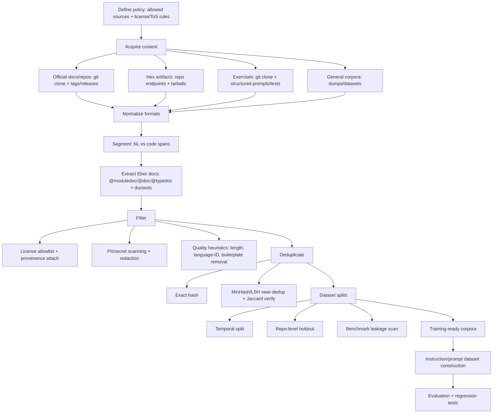
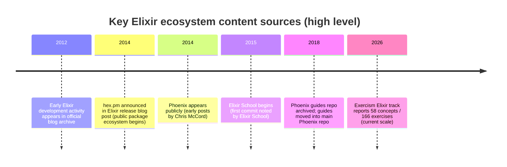

# Elixir-Focused NL Corpora for Prompt Understanding in a Single-Language Code LLM

## Executive summary

I interpret “NL/prompt understanding” for an Elixir-targeted code LLM as the ability to correctly map natural-language developer intent (questions, instructions, constraints, context) into Elixir-idiomatic code, explanations, and follow-up questions, across common Elixir/Phoenix/OTP tasks. This capability is not achieved by “Elixir code only” in practice: you typically need **Elixir-adjacent natural language** (docs, READMEs, examples, exercises, Q&A, change logs, and problem statements) plus a training/evaluation strategy that prevents benchmark leakage and reduces privacy and licensing risk. citeturn33view0turn35view1turn22view0

For Elixir-specific, legally clearer NL sources, I would prioritize (in roughly this order): **Elixir official docs and guides** (Apache-2.0), **Elixir official website guides + blog text** (Apache-2.0 for textual guides/blog), **Elixir School lessons/blog content** (Apache-2.0), **Phoenix source + guides** (MIT), **Exercism’s Elixir track instructions/tests/docs** (MIT), and **Hex package artifacts/metadata** (license varies per package; acquisition should use official repository/API mechanisms rather than scraping). citeturn29view0turn24view0turn7view0turn5view0turn17search0turn11view0turn2view1

For community discussion sources, I recommend a conservative stance: **Elixir Forum is explicitly not suitable for training a chatbot/LLM without permission** per its Terms of Service (it even gives “LLM/chatbot” as an example of prohibited repurposing). Stack Overflow/Stack Exchange dumps can be used under CC BY‑SA, but share‑alike + attribution requirements introduce operational and compliance complexity for model training and redistribution. citeturn2view0turn34view0turn30view0turn30view2

For general software-engineering NL (useful to improve broad prompt comprehension and “developer English”), I would treat Common Crawl and similar web corpora as **high coverage but high legal/quality noise**, and instead prefer **well-governed datasets** (e.g., Wikipedia dumps under CC BY‑SA, CodeSearchNet with per-file license metadata, and opt‑out governed corpora such as BigCode’s “The Stack” derivatives when you need large-scale code-adjacent NL like docstrings and READMEs). citeturn38search0turn19search2turn36view0turn19search3turn26search0turn37search2

I assume no unstated constraints: I don’t know whether you intend to (a) release the resulting model and training data, (b) sell access commercially, (c) restrict training to permissive licenses only, or (d) require fully reproducible provenance. Where those constraints matter, I explicitly label details as **unspecified** and recommend choices that remain robust under stricter regimes.

## What I mean by NL and prompt understanding for an Elixir-only assistant

When I say “NL/prompt understanding component” for a code-focused LLM, I mean training signals that teach the model to:

1) **Parse developer intent** in English prompts (requirements, constraints, edge cases, “do/don’t” instructions).  
2) **Ground that intent in Elixir idioms** (pattern matching, OTP structure, supervision trees, `GenServer`, `Task`, `Stream`, `Ecto`, `Plug`, Phoenix contexts, etc.).  
3) **Follow instruction structure**: produce code, tests, docs, explanations; ask clarifying questions when needed.  
4) **Stay aligned with ecosystem conventions**, including style and documentation practices (e.g., `@moduledoc`, `@doc`, `@typedoc`, doctests). citeturn33search0turn25search16turn35view1

The key point for dataset design is that a lot of this competence is encoded in **Elixir-adjacent NL** (documentation pages, tutorial narratives, exercise problem statements, changelog notes, “why” explanations, and Q&A). The Elixir docs explicitly emphasize documentation as “first-class,” and the docs ecosystem (ExDoc + HexDocs) makes high-quality text+code examples unusually accessible compared to many languages. citeturn33search0turn12search1turn12search11

## Elixir-specific NL resources and how I would use them

Below, I describe the most practically useful Elixir-centric NL sources, including **resource attributes** you asked for: acquisition method, licensing notes, typical quality/noise, size/coverage (or unspecified), useful subcorpora, preprocessing needs, dedupe/decontam suggestions, PII/security risks, and metadata to retain.

**Elixir official docs on HexDocs (Elixir “Getting Started” + guides + reference text)**  
Resource type: official docs/API docs/tutorial guides. citeturn35view0turn12search23  
Typical acquisition: I would not scrape rendered HTML if avoidable. HexDocs pages include a “View Source” link back to GitHub; the most robust acquisition is cloning the Elixir repo and extracting docs/guide sources from the repository history. citeturn35view0turn23search2  
Licensing/legal: Elixir is Apache‑2.0; Elixir’s Open Source Policy says the policy scope covers “documentation and any associated assets,” and “all code released by the Elixir team is licensed under Apache‑2.0.” citeturn29view0turn6view0turn35view1  
Quality/noise: generally high signal, curated, consistent terminology; relatively low noise; stable across versions. citeturn35view0turn33search0  
Size/coverage: substantial but not numerically specified in public docs (I treat as unspecified).  
Useful subcorpora:  
- Explanatory prose sections (“Introduction”, Mix/OTP guide, guidelines). citeturn35view0turn35view1  
- Embedded code snippets. citeturn35view0turn35view1  
- Documentation guidance pages (doctests, `@doc`/`@moduledoc` usage) that can seed “write docs” prompts. citeturn33search0turn25search16  
Preprocessing needs: HTML/Markdown normalization (depending on source files), extraction of code blocks, version tagging (docs are versioned), and code-vs-NL segmentation. citeturn35view0turn33search0  
Dedup/decontam: use exact hash + near-dedup across versions (doc pages can repeat). I recommend time/version splits (e.g., train ≤ v1.18, eval on v1.19 docs) to test “prompt understanding” rather than memorization. citeturn35view0turn23search11  
PII/security: low overall.

**Elixir official website guides and blog text (elixir-lang.org)**  
Resource type: official docs/tutorial/blog. citeturn13search1turn23search1  
Acquisition: clone the official website repository (Jekyll content) and ingest `_posts`, guides, and related markdown. citeturn24view0  
Licensing/legal: the repo states the “written textual contents available in the guides and blog are licensed under Apache License, Version 2.0,” while some site assets (HTML/CSS theme) have different licensing. citeturn24view0L370-L378  
Quality/noise: high-quality narrative content; sometimes more conceptual than reference docs; good for intent mapping (“how to think about OTP,” motivations, releases). citeturn13search1turn23search13  
Size/coverage: unspecified, but many years of posts exist; the blog index shows posts from early Elixir history onward. citeturn13search1  
Useful subcorpora: release announcements (include constraints and migration guidance), blog tutorials. citeturn23search13turn32search5  
Preprocessing: markdown parsing; extract headings as “instruction templates” (“In this post we will…” → prompt skeleton).  
Dedup/decontam: use temporal splits; exclude posts that might overlap with eval prompts.  
PII/security: low.

**Phoenix framework docs and repository guides**  
Resource type: framework docs/tutorial/guides + code-adjacent NL (README, guides). citeturn32search20turn16view0  
Acquisition: clone the Phoenix repo; note that the older phoenix_guides repo indicates guides moved into the main Phoenix repo under `guides/`. citeturn16view0L215-L220  
Licensing/legal: Phoenix is MIT (license file explicitly states “MIT License”). citeturn5view0turn14search13  
Quality/noise: high; guides are curated, and the project has strong conventions; very helpful for “web app” instruction-following. citeturn14search13turn13search19  
Size/coverage: unspecified (but broad).  
Useful subcorpora:  
- Guides/docs with step-by-step tasks (“generate a project”, “configure releases”, “routes/controllers”). citeturn14search6turn13search19  
- Code comments and module docs where present.  
Preprocessing: markdown/HTML parsing; code fence extraction; mapping between prose and referenced modules.  
Dedup/decontam: repo-level holdout is valuable: e.g., hold out one Phoenix major version’s guide set for evaluation.  
PII/security: low-to-medium (issues/PR text is a separate source; see below).

**Elixir School lessons and blog posts**  
Resource type: tutorials/lessons + blog posts (highly prompt-like narrative). citeturn25search8turn30search12  
Acquisition: clone the `elixirschool/elixirschool` content repository (lessons/blog). The repo itself says it contains lessons and blog posts, with website code elsewhere. citeturn30search0turn7view0  
Licensing/legal: Apache‑2.0 license in the repo. citeturn7view0turn25search1  
Quality/noise: generally high, tutorial-driven; some variation across authors and translations. citeturn30search12turn25search13  
Size/coverage: historically large; Elixir School notes first commit date and ongoing growth (useful for timeline). citeturn32search2  
Useful subcorpora:  
- Lesson prose and “Try it” task descriptions; these can be converted into instruction examples. citeturn25search8turn30search16  
- Blog posts about testing, releases, patterns (good for ops prompts). citeturn30search12turn30search0  
Preprocessing: language identification (Elixir School supports many translations); markdown parsing; code block extraction; keep per-language variants as separate corpora with language tags. citeturn32search22turn7view0  
Dedup/decontam: exact/near dedup across translations should be **language-aware**: translations aren’t duplicates but can create leakage if your eval includes English content duplicated elsewhere.  
PII/security: low.

**Exercism Elixir track (exercise instructions + tests + docs)**  
Resource type: human-authored exercise prompts, concept explanations, tests. citeturn22view0turn17search7  
Acquisition: clone `exercism/elixir` repo; optionally ingest the track docs structure described by Exercism (“docs/ABOUT.md”, “docs/INSTALLATION.md”, etc.). citeturn17search0turn17search7  
Licensing/legal: the `exercism/elixir` track repository is MIT; Exercism docs state exercises are “licensed mainly under the MIT License” and available via their GitHub repositories. citeturn17search0turn17search3  
Quality/noise: very strong prompt signal: exercises are explicit tasks with constraints, and tests provide unambiguous success criteria. citeturn22view0turn17search7  
Size/coverage: the track page reports 166 exercises grouped into 58 concepts (as of Feb 26, 2026). citeturn22view0  
Useful subcorpora:  
- “Problem statement → tests” pairs (excellent for instruction tuning). citeturn22view0  
- Concept docs that explain idioms and expected solutions. citeturn22view0turn17search7  
Preprocessing: parse markdown; extract explicit constraints; optionally auto-generate multiple prompt variants per exercise (see synthetic prompts section below).  
Dedup/decontam: treat Exercism tasks as *evaluation gold* or *training material*, but not both. If you use it for training, hold out a substantial random subset + entire concept families for eval.  
PII/security: low.

**Hex / HexDocs package ecosystem (READMEs, “extra pages”, module docs, license metadata, changelogs)**  
Resource type: code-adjacent NL at scale (package docs, READMEs, module docs, changelogs). citeturn12search1turn10search22turn8search1  
Acquisition: I would avoid scraping hex.pm pages because Hex’s Terms restrict scraping and require adherence to published interfaces; the Terms explicitly say scraping “without prior consent … is expressly prohibited,” while API access is governed by those Terms. citeturn2view1L41-L42  
Instead, I would use the **Hex repository endpoints** and tarballs described in the Hex specifications: `/packages/PACKAGE`, `/tarballs/PACKAGE-VERSION.tar`, etc., and/or the Hex HTTP API where appropriate. citeturn11view0turn25search3  
Licensing/legal: **variable**. Hex package pages expose a “License” field (e.g., BSD 3‑Clause for one package; MIT for others). citeturn8search1turn10search4  
Local package metadata and publishing flows explicitly include `:licenses` and the package tarball contents typically include README and LICENSE files. For example, Hex build docs list default included files like `README*` and `LICENSE*`, and the package metadata supports `:licenses`. citeturn27search6turn33search1  
Quality/noise: wide variance. Excellent docs exist; many packages have minimal or outdated READMEs.  
Size/coverage: very large (unspecified in aggregate).  
Useful subcorpora:  
- READMEs and guides (often written in “how to use” prompt style). citeturn27search6turn10search7  
- ExDoc module docs and “extra pages” at HexDocs, which are often tutorials. citeturn35view1turn10search22  
Preprocessing: archive extraction; markdown parsing; code/NL segmentation; language ID; mapping docs ↔ package versions; license normalization (SPDX).  
Dedup/decontam: strong need for dedup because READMEs, templates, and generated docs repeat; near-dedup methods such as MinHash+LSH with a Jaccard threshold (0.85 is used in prominent code corpora pipelines) are a defensible starting point. citeturn26search0turn37search4  
PII/security: **medium**. READMEs and docs may contain emails, API endpoints, and occasionally secrets in examples. I would run secret scanners and redact.  

**GitHub issues/PR discussions for major Elixir projects (elixir-lang/elixir, phoenixframework/phoenix, etc.)**  
Resource type: conversational technical NL; very prompt-like (“How do I…?”, bug reports, design rationale).  
Acquisition: GitHub API or public dataset mirrors (e.g., BigQuery GitHub datasets and GH Archive concepts exist). citeturn33search3turn33search6  
Licensing/legal: this is one of the trickiest areas. GitHub’s Terms clarify that public repositories can be viewed and forked, and that contributions to a repository with a license are licensed under that repository’s license (“inbound=outbound”), but other user-generated content (including issues/comments) is licensed for reproduction “solely on GitHub” via GitHub functionality unless you adopt a separate license. citeturn9view0L210-L218  
Because of that ambiguity, I would treat issues/PR text as **higher legal risk** than the repository’s source files unless the project explicitly licenses those discussions.  
Quality/noise: high variance; contains valuable bug-focused prompt patterns but also off-topic conversation.  
PII/security: **high**. Issues can contain stack traces, credentials, private URLs, and personal details. Redaction and filtering are mandatory.

**Elixir Forum**  
Resource type: community Q&A / discussion.  
Acquisition: technically scrapeable, but Terms-of-Service constraints dominate.  
Licensing/legal: the site explicitly prohibits adapting/copying/republishing content beyond personal non-commercial use, and gives “repurposing… into a Q&A type site/chatbot/LLM” as an example of prohibited derivative work without permission. citeturn2view0L31-L33  
Recommendation: do **not** use for LLM training unless you have explicit written permission and can comply with those terms.  
PII/security: high (user accounts, personal anecdotes).

**Elixir-related mailing list archives (e.g., elixir-lang-talk, elixir-lang-core)**  
Resource type: mailing list discussions (technical design + Q&A). citeturn8search3turn8search7  
Acquisition: Google Groups archives and third-party mail archives. citeturn8search3turn8search10  
Licensing/legal: often **unspecified**; also subject to Google platform terms; not a clean open-license corpus by default.  
Quality/noise: mixed; can be excellent for deep design rationale.  
PII/security: high (email addresses, named individuals).  

**Commercial books (Programming Elixir; Elixir in Action)**  
Resource type: books/tutorials (high-quality NL). citeturn1search3turn20search0  
Acquisition: purchase/licensed access only.  
Licensing/legal: not open. Manning’s Terms of Use reserve rights and prohibit reproducing/distributing/creating derivative works from subscription content; they are explicit about restrictions. citeturn38search1  
This makes books generally unsuitable for open training unless you obtain explicit rights from the publisher/authors.  
PII/security: low, but licensing barrier dominates.

## General software-engineering NL resources that still help Elixir prompting

General-purpose software-engineering NL benefits Elixir-focused prompt understanding in two main ways: (1) it improves broad instruction following (“write unit tests”, “optimize memory”, “add logging”), and (2) it helps the model handle cross-language conceptual prompts (“actor model”, “idempotency”, “backpressure”) that appear in Elixir contexts.

**Stack Exchange / Stack Overflow data dumps (CC BY‑SA)**  
Acquisition: Internet Archive hosts Stack Exchange dumps and lists them as CC BY‑SA 4.0 for a given dump snapshot. citeturn18search8turn30search2  
Licensing/legal: Stack Overflow Terms say the “Creative Commons Data Dump” is licensed under CC BY‑SA and that downloading it binds you to that license. Subscriber content is licensed under CC BY‑SA 4.0. citeturn34view0L139-L150  
Practical note: CC BY‑SA’s attribution + share‑alike conditions complicate model release and dataset redistribution, and you should plan compliance early.  
Quality/noise: high prompt usefulness, but includes outdated answers and inconsistent code quality.  
PII/security: medium (usernames; occasional personal data).

**Wikipedia / Wikimedia dumps**  
Acquisition: dumps.wikimedia.org provides dumps with detailed license guidance. citeturn19search1turn38search8  
Licensing/legal: Wikimedia dump licensing information says content may be shared/copied/remixed and used for any purpose (including commercial) subject to Wikimedia licensing policies; Wikipedia database download pages explicitly state CC BY‑SA 4.0 (and often also GFDL). citeturn19search1turn19search12  
Quality/noise: broad, generally well-moderated; useful for general world knowledge and terminology, but only indirectly “developer prompt” oriented.  
PII/security: low.

**Common Crawl WET (web text extraction)**  
Acquisition: Common Crawl provides WET files with extracted plaintext and documents how WET files work. citeturn19search2turn19search6  
Licensing/legal: Common Crawl Terms emphasize that crawled content can be subject to separate terms from original content owners and that you must respect copyrights; this is a significant legal/compliance risk for training data unless you filter to sites with compatible licenses. citeturn36view0L37-L69  
Quality/noise: very noisy; high duplication; significant PII risk.  
Recommendation: for an Elixir-only model, I would treat Common Crawl as optional and only after establishing a robust license/PII filtering pipeline.

**CodeSearchNet (function-docstring/code-search style NL pairs)**  
Acquisition: CodeSearchNet provides a corpus and emphasizes that licenses for source code are provided in `_licenses.pkl` files; project code/docs are MIT. citeturn19search3turn19search14  
Coverage: not Elixir-specific (six languages in the original release), but it’s relevant as a proven template for aligning NL descriptions with code and for building evaluation tasks. citeturn19search14  
PII/security: low-to-medium.

**Curated governance-focused corpora (BigCode “The Stack” and related components)**  
Acquisition: the dataset card for bigcode/the-stack describes near-dedup methodology (MinHash 256 permutations + LSH + Jaccard threshold 0.85). citeturn26search0turn37search4  
Relevance: The Stack is mostly code, but it contains substantial code-adjacent NL (docstrings, READMEs, and in separate releases even GitHub issues). The BigCode ecosystem also provides opt-out tooling. citeturn37search2turn37search17  
If you need “industrial-scale” Elixir docstrings/READMEs, filtering The Stack to Elixir files plus their adjacent documentation is one pragmatic route—but you still must enforce licensing and provenance rules for downstream use. citeturn26search3turn26search10

## Comparison table of recommended resources

The table below includes both Elixir-specific and general resources. If a detail is not publicly specified, I mark it **unspecified**.

| Resource name | Type | Typical acquisition method | License / legal notes | Preprocessing notes | Suggested dedup approach | PII risk |
|---|---|---|---|---|---|---|
| Elixir official docs on HexDocs | Official docs/tutorials | Clone elixir-lang/elixir; use “View Source” GitHub links from HexDocs pages citeturn35view0turn23search2 | Apache‑2.0; Elixir policy scope includes documentation/assets citeturn29view0turn6view0 | Parse markdown/doc sources; extract code blocks; keep version tags citeturn35view0 | Exact hash + near-dedup across versions; version-based holdouts | Low |
| Elixir official website guides + blog (repo) | Official blog/guides | Clone elixir-lang/elixir-lang.github.com (Jekyll) citeturn24view0 | Textual guides/blog under Apache‑2.0 (theme assets differ) citeturn24view0L370-L378 | Markdown parsing; heading-based prompt templates | Exact + near-dedup; temporal splits | Low |
| elixir-lang/elixir repository docs/docstrings/tests | Official repo content | Git clone; extract `@doc/@moduledoc`, doctests, comments | Apache‑2.0; docs included in policy scope citeturn29view0turn33search0 | Elixir-specific doc extraction; keep file paths/versions | Exact + near-dedup; repo-level holdouts | Low–Med |
| Phoenix (phoenixframework/phoenix) guides + docs | Official framework docs | Git clone; guides now in repo; HexDocs for rendered pages citeturn16view0turn13search19 | MIT (license file) citeturn5view0turn14search13 | Markdown parsing; code fence extraction | Exact + near-dedup | Low |
| ExDoc (ex_doc) docs and README | Tool docs | Clone repo; ingest README and docs | Apache‑2.0 for tool; generated doc output licensing varies by project citeturn1search5turn1search13 | Markdown parsing; keep as “doc tooling” domain | Exact dedup (small corpus) | Low |
| Elixir School lessons + blog content | Tutorials/blog | Clone elixirschool/elixirschool content repo citeturn30search0turn7view0 | Apache‑2.0 citeturn7view0 | Language detection (many translations); markdown parsing | Exact + near-dedup; language-aware handling | Low |
| Exercism Elixir track | Exercises/prompts/tests | Clone exercism/elixir; ingest docs + exercise statements + tests citeturn17search0turn17search7 | MIT; Exercism says exercises mainly MIT and in GitHub repos citeturn17search0turn17search3 | Treat “instructions + tests” as instruction tuning pairs | No overlap with eval; hold out families of exercises | Low |
| Hex package tarballs + metadata | README corpus, API docs | Use Hex repository endpoints (`/packages`, `/tarballs`) and/or API; avoid scraping citeturn11view0turn2view1 | License varies per package; package pages show SPDX-like license fields citeturn8search1turn10search4 | Extract README/LICENSE/changelog from tarballs; normalize SPDX | Exact + MinHash/LSH; heavy template dedup | Medium |
| Stack Exchange Data Dump (filter to Elixir tags) | Q&A | Download dump snapshot (Internet Archive) citeturn30search2 | CC BY‑SA 4.0 via dump listing; SO Terms confirm CC BY‑SA dump citeturn30search2turn34view0L139-L150 | XML parsing; extract Q/A pairs; tag filtering | Exact + near-dedup; temporal cutoffs | Medium |
| Wikipedia / Wikimedia dumps | General NL | Download dumps from dumps.wikimedia.org citeturn19search1turn38search8 | CC BY‑SA 4.0 (and often GFDL); detailed dump licensing guidance citeturn19search12turn19search1 | Strip markup/templates; sentence splitting | Exact + near-dedup | Low |
| Common Crawl WET | Web text | Download WET files citeturn19search2turn19search6 | Underlying pages may have separate ToS; must respect rights; high compliance burden citeturn36view0L37-L69 | Aggressive filtering, language ID, boilerplate removal | Heavy dedup (web has extreme duplication) | High |
| CodeSearchNet | NL–code pairs | Download from GitHub/hosted corpus citeturn19search3turn19search14 | Project under MIT; per-file code licenses provided in `_licenses.pkl` citeturn19search3 | Map docstrings/comments to functions; normalize | Exact + near-dedup | Low–Med |
| BigCode “The Stack” (filtered to Elixir) | Code + code-adjacent NL | Use dataset releases; filter on language and file types citeturn37search0turn26search3 | Permissive-license focus; provenance provided; opt-out exists citeturn26search3turn37search2turn37search17 | Keep license/provenance metadata; extract docstrings/READMEs | MinHash+LSH; Jaccard 0.85 is documented in dataset card citeturn26search0 | Low–Med |
| Elixir Forum | Community forum | (Not recommended) | Explicitly prohibits repurposing content into chatbot/LLM without permission citeturn2view0L31-L33 | N/A | N/A | High |

## Best practices for building an Elixir-focused NL corpus

I recommend treating dataset construction as a **governed pipeline** where licensing, deduplication, and PII mitigation are first-class outputs, not afterthoughts.

**Licensing and legal hygiene (practical, not exhaustive legal advice)**  
I would enforce an explicit “allowed license policy” at ingestion time, and attach license metadata to every document/example. For Elixir core content, Apache‑2.0 is clear and explicitly applies to docs/assets under its policy scope. citeturn29view0turn6view0  
For Phoenix, MIT is clear for repo content. citeturn5view0  
For Hex packages, license is per-package and surfaced in package metadata/pages; you must retain attribution/provenance to respect those licenses. citeturn8search1turn26search3  
For Stack Overflow dumps, CC BY‑SA compliance planning is required (attribution + share-alike). citeturn34view0L139-L150  
I would exclude forums whose terms directly prohibit chatbot/LLM repurposing (Elixir Forum). citeturn2view0L31-L33  
I treat commercial books as “do not ingest” unless you have explicit publisher/author permission; Manning’s terms are explicit about restrictions. citeturn38search1

**Metadata and provenance (what I would retain for every sample)**  
At minimum, I would retain: `source_name`, `canonical_url`, `repo_url` (if applicable), `file_path`, `commit_hash` or `release_version`, `timestamp`, `license_spdx` (or “unspecified”), `author_handle` (if public), `language_tag` (human language), `programming_language=elixir`, and “content type” labels (README, `@doc`, tutorial, exercise prompt, changelog). This is aligned with the idea of provenance support emphasized in governance-focused datasets. citeturn26search3turn26search10

**Preprocessing and segmentation choices**  
For Elixir, I think the highest ROI preprocessing steps are:

- **Doc extraction from Elixir sources**: parse `@moduledoc`, `@doc`, `@typedoc`, and doctest blocks; these are explicitly part of how Elixir expects documentation to be written and maintained. citeturn33search0turn25search16  
- **Markdown normalization**: Elixir School, README corpora, and many Hex “extra pages” are Markdown-heavy. citeturn30search0turn35view1  
- **Code vs NL segmentation**: keep code fences as separate spans and preserve mapping to surrounding explanatory prose (this is the alignment you need for prompt understanding).
- **Language identification**: Elixir School has many translations; I would keep each language variant but label it and avoid leaking translations from train to eval when evaluating prompt-following in English. citeturn32search22turn7view0

**Deduplication and contamination mitigation**  
I would implement a two-layer dedup strategy:

1) **Exact dedup** (hash-based) to remove identical files/snippets.  
2) **Near-dedup** using MinHash + LSH clustering plus Jaccard verification; a Jaccard threshold of **0.85** is a common, well-documented choice in large code corpora pipelines. citeturn26search0turn37search4  

For contamination control (benchmark leakage), I recommend:

- **Temporal splits**: choose a training cutoff date and ensure eval data is newer (or from held-out sources). This is especially important because docs and READMEs are often copied between repos.  
- **Repo-level holdouts**: hold out entire repos (or families) for evaluation; e.g., keep some Hex packages unseen during training and test whether the model can interpret their docs and write correct integration code.  
- **String/AST overlap checks**: for any Elixir HumanEval-like evaluation you build, scan training data for near-matches of prompts and canonical solutions (exact and near-duplicate checks).

**PII/security risks and redaction guidance**  
I recommend a layered safety approach:

- Run secret detectors on all sources that can contain credentials (READMEs, issues, tutorials).  
- Strip or hash personal emails/usernames where not required; mailing lists and issues are high-risk.  
- For Git history and commit messages, explicitly redact `Author <email>` fields and exclude diffs containing keys/certs.

## Recommended preprocessing pipeline and evaluation checks for Elixir prompt-following

### Preprocessing pipeline flow (typical)



The key design intent is that “prompt understanding” data should be **aligned**: keep the natural-language instruction and the Elixir code/tests it refers to as a paired unit whenever you can (e.g., Exercism; doctests; docs + examples). citeturn22view0turn25search16turn33search0

### Short timeline of Elixir ecosystem resources relevant to this corpus



Evidence points: Hex announcement appears in an Elixir official blog release post from April 2014. citeturn32search5  
Elixir School’s own blog notes its first commit date (May 31, 2015). citeturn32search2  
The older Phoenix guides repo is archived and says guides moved to the Phoenix repo. citeturn16view0L149-L220  
Exercism Elixir track size is stated on the track page. citeturn22view0

### Evaluation checks I recommend for Elixir prompt-following

I recommend three complementary evaluation layers:

**Execution-grounded code correctness**  
Build (or adapt) an Elixir benchmark where each prompt has an ExUnit test suite and the model output is executed in a sandbox. The Exercism structure (instruction + tests) is a strong template; you can treat a held-out subset as an eval benchmark. citeturn22view0turn17search7

**Prompt-following under constraints**  
Create instruction sets that include constraints common in Elixir prompts:  
- “Use pattern matching, do not use `if`.”  
- “Do not use external dependencies.”  
- “Write `@doc` and doctests.”  
These constraints map directly onto Elixir’s documented tooling and doc primitives (`@doc`, doctests). citeturn33search0turn25search16

**Contamination/leakage audits**  
I would run automated leakage checks that search for prompt strings, solution hashes, and near-duplicate variants across the training corpus using the same dedup machinery described above (exact + MinHash/LSH). The reason to reuse dedup tooling is that it catches both accidental duplication and “benchmark hidden in docs/README” leakage patterns documented in large code corpora practice. citeturn26search0turn37search4

### Practical links (non-exhaustive)

I’m including links in a compact, copyable form (as requested), but most citations in this report are already clickable.

```text
Elixir docs (HexDocs): https://hexdocs.pm/elixir/
Elixir website source (license notes for guides/blog text): https://github.com/elixir-lang/elixir-lang.github.com
Elixir language repo: https://github.com/elixir-lang/elixir
Phoenix repo: https://github.com/phoenixframework/phoenix
Elixir School content repo: https://github.com/elixirschool/elixirschool
Exercism Elixir track repo: https://github.com/exercism/elixir
Hex specifications (repo endpoints): https://github.com/hexpm/specifications/blob/main/endpoints.md
Stack Exchange dump snapshot (example): https://archive.org/details/stack-exchange-data-dump-2023-03-08
Wikimedia dumps licensing: https://dumps.wikimedia.org/legal.html
Common Crawl WET explanation: https://commoncrawl.org/blog/web-archiving-file-formats-explained
CodeSearchNet: https://github.com/github/CodeSearchNet
BigCode The Stack dataset card: https://huggingface.co/datasets/bigcode/the-stack
```

