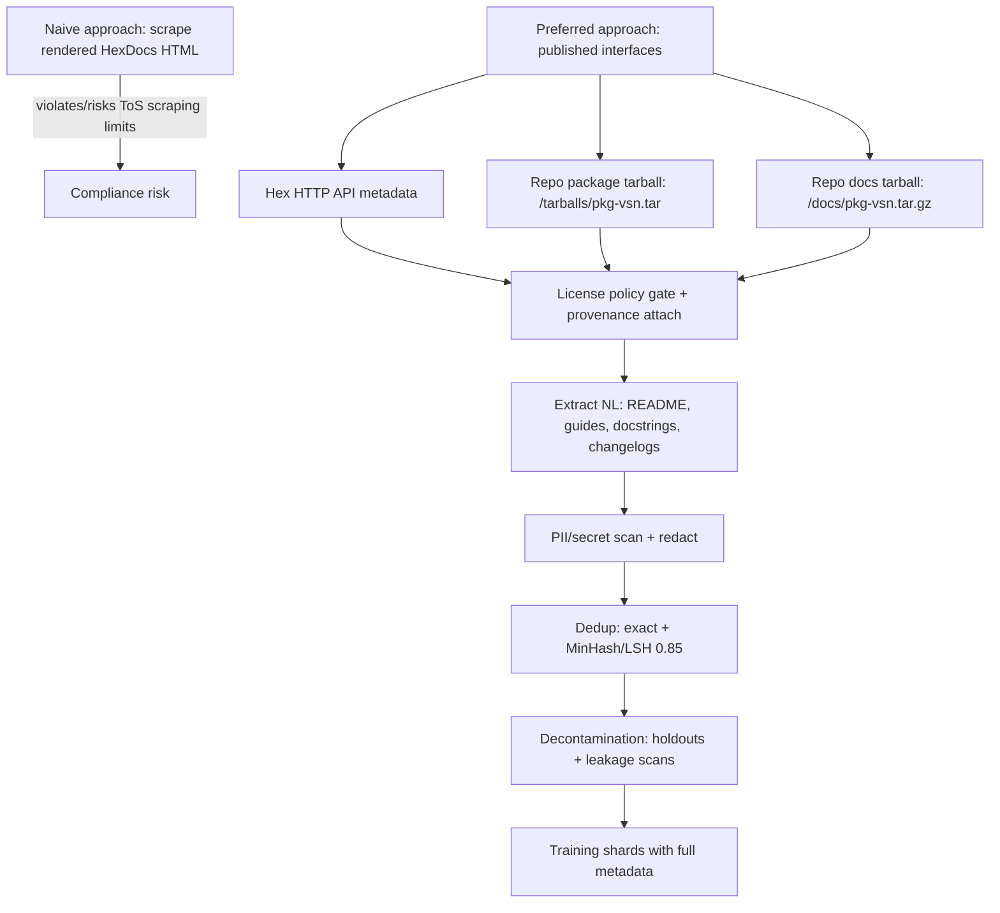

# HexDocs and hex.pm licensing for training data in an Elixir NL/prompt corpus

## Executive summary

I do **not** assume that documentation hosted on HexDocs or packages hosted on hex.pm are “open source” merely because they are public and downloadable. In the Hex ecosystem, what you can legally reuse for training depends primarily on the **package author’s license choices** and secondarily on Hex’s **platform Terms of Service** (especially around automated access and scraping). citeturn1view0turn23view0turn5view2

For **public packages**, Hex’s policies and specifications strongly indicate that packages must declare a license in package metadata, and that metadata (including the license list) is exposed via the Hex API and embedded in package tarballs (`metadata.config`). citeturn23view0turn5view2turn9view0 However, “has a license” is not the same as “open-source software license”: Hex hosts packages with licenses like MIT (typical OSS) as well as content-oriented/share-alike licenses such as **CC-BY-SA-4.0** (which can materially change redistribution obligations). citeturn7view2turn21view0

Hex/HexDocs does **not** appear to grant downstream users an extra blanket right to reuse package contents beyond what the author’s license already allows. Instead, Hex’s Terms emphasize that content is the responsibility of the uploader and that you retain rights to your content; meanwhile, Hex obtains (from the uploader) a broad license to host and distribute that content. citeturn1view0

Practically, for building an Elixir NL/prompt corpus, this pushes me toward a “license-first, tarball/API-first” pipeline: use **published interfaces** (HTTP API + repository endpoints and tarballs) rather than scraping HTML pages, attach **per-package/per-version license metadata** to every sample, enforce an **allowed-license policy**, and treat docs tarballs and package tarballs as the authoritative artifacts—while still mapping back to source repositories via `source_url` and ExDoc “View Source” patterns when available. citeturn1view0turn12view0turn24view0turn7view0turn9view0

I am not a lawyer; I’m describing how Hex’s official docs/specs/terms structure the problem and what that implies for dataset engineering. Where Hex’s public documentation does not fully specify a detail (for example, how consistently license metadata matches LICENSE files in practice), I label it **unspecified**.

## Legal status and what qualifies as open source on HexDocs and hex.pm

### Hex terminology matters: “repository” vs “source repository”

In Hex specifications, the “repository” is a **read-only endpoint** that delivers the registry and package tarballs (and supports private repositories under `/repos/REPO/...`). This is distinct from a project’s source code repository on a platform like entity["company","GitHub","code hosting"] or GitLab. citeturn5view0turn14view1turn9view0

### What licenses apply to HexDocs pages, package listings, and tarballs

Hex’s documentation and specs make three points particularly relevant to training-data legality:

**A package must specify a license (policy-level requirement).** Hex’s Code of Conduct states that packages “must specify a license” under which users can access and use the package and its contents as a dependency, and it links to both the Open Source Initiative and the SPDX license list. citeturn23view0turn23view2

**License metadata is stored as package metadata (protocol-level and publishing docs).**  
In the package tarball, `metadata.config` contains a `licenses` field, listed as required in the official package metadata spec. citeturn5view2turn5view1  
Hex’s publishing guide similarly says the `:licenses` field is required and points to SPDX identifiers. citeturn24view0turn22search3

**Hex/HexDocs does not “relicense” content as open source just by hosting it.**  
Hex’s Terms of Service say: you retain rights to the content you submit; for public content (non-private), you grant Hex (Six Colors) a broad license to use/copy/modify/publish/distribute it; and content can be viewed publicly. These are platform-hosting rights, not an automatic open-source license grant to everyone else. citeturn1view0turn15search2

### Concrete evidence that Hex-hosted content is not uniformly “OSS licensed”

The hex.pm package pages show the declared license(s) for each package, and examples vary:

- **MIT**: Phoenix on hex.pm lists MIT. citeturn7view2  
- **BSD 3‑Clause**: `json` lists BSD 3‑Clause. citeturn7view3  
- **Creative Commons Share-Alike**: `mecto` lists **CC‑BY‑SA‑4.0**. citeturn21view0  
- **Mixed license lists**: `hex_licenses` lists multiple licenses including Creative Commons variants (CC‑BY‑4.0, CC‑BY‑3.0) and CC0. citeturn7view4  

This supports a key operational conclusion: “public on hex.pm” does not imply “safe to treat as permissive open-source training data.” At minimum, it implies you must do **per-package license classification** and decide what licenses you will accept. citeturn21view0turn7view4

### HexDocs pages and docs tarballs: licensing of docs content

Hex’s publishing docs describe that documentation is automatically published to HexDocs when you publish a package, and the FAQ clarifies that documentation is generated locally and uploaded. citeturn24view0turn15search12

In the Hex API specification (API Blueprint), Hex explicitly describes “Package Documentation” as an uploadable artifact and states (as an implementation detail for hex.pm) that the uploaded docs tarball is served under `https://repo.hex.pm/docs/{package}-{version}.tar.gz` and its contents are served at HexDocs URLs. citeturn12view0turn12view2

**What this means legally (as far as the publicly documented system implies):** the docs you see on HexDocs are an uploaded artifact produced by the package owner, and it should be treated—like the package tarball—as copyrighted material licensed under whatever license(s) apply to that package/release and its documentation files. Hex’s own terms focus on hosting rights and access rules, not on granting new downstream reuse rights. citeturn1view0turn12view0turn5view2

### Private packages and private docs are not open-source by default

Hex supports private packages and private repositories for organizations (pricing and specs both reflect this). citeturn7view6turn5view0turn15search20  
Hex’s Terms define “Private Content” to include private package contents, associated documentation, and package metadata, and impose confidentiality obligations on Hex. citeturn1view0turn22search26  

For corpus building, I treat anything requiring authentication (private repositories/docs) as **out of scope** unless you have explicit rights and consent, because it’s not public/open by default and is explicitly treated as confidential in Hex’s terms. citeturn1view0turn15search20turn5view0

### Summary table: Hex artifacts and the controlling legal/metadata signals

| Artifact you might ingest | What it is (per Hex docs/specs) | Where license metadata is found | Does Hex grant extra reuse rights? | Practical “open source” conclusion |
|---|---|---|---|---|
| hex.pm package page | HTML listing of package metadata incl. license | Displayed from package metadata (`licenses`) citeturn9view0turn7view2 | No explicit blanket reuse grant; Terms govern access; content remains uploader’s responsibility citeturn1view0 | Not inherently OSS; must check license value per package |
| Package tarball (`/tarballs/PACKAGE-VSN.tar`) | Standard package artifact: VERSION, `metadata.config`, `contents.tar.gz`, CHECKSUM citeturn5view1turn5view0 | `metadata.config` includes `licenses` list citeturn5view2turn5view1 | No extra blanket reuse grant; rely on package’s license(s) citeturn1view0 | Treat as licensed content; include only under allowed-license policy |
| Docs tarball (`/docs/package-vsn.tar.gz`) | Uploaded docs artifact; served from repo, rendered on HexDocs citeturn12view0turn12view2 | **Unspecified** in protocol; practically, it can include LICENSE pages/files but not guaranteed | No extra blanket reuse grant; rely on package’s license(s) citeturn1view0 | Treat as licensed documentation; still per-package license checks |
| Rendered HexDocs HTML pages | Static served docs at `hexdocs.pm/{package}/{vsn}` citeturn12view0turn24view0 | **Unspecified** at page level; derive from package release metadata + included artifacts | Access is governed by Terms (including scraping restrictions) citeturn1view0 | Prefer tarball/API acquisition; treat content as licensed by author, not by platform |

## Practical acquisition without scraping rendered pages

### Why I recommend API/tarball acquisition instead of scraping

Hex’s Terms of Service explicitly restrict automated access: you may not “access or search” the services by automated means other than the “published interfaces,” and it states that “scraping … without prior consent … is expressly prohibited” (while crawling may be permitted per robots.txt). citeturn1view0turn15search2  

Therefore, for a compliant-by-default pipeline, I recommend:

- Use **Hex published interfaces** (HTTP API + repository endpoints and tarballs) instead of HTML scraping. citeturn5view0turn9view0turn1view0  
- Respect **rate limits** and the requirement to send a valid **User-Agent** header on the API. citeturn9view0

### Recommended acquisition methods and mapping docs to source repos

#### Acquire package metadata and license signals

The Hex API spec defines package responses that include:

- `meta.licenses` (array)  
- `meta.links` (map; often includes “GitHub” or “GitLab”)  
- `docs_html_url` pointing to HexDocs  
- optional `private` flag indicating access control citeturn9view0turn12view3  

This gives you a high-level metadata layer to decide whether to download and ingest a given release (and what license policy applies). citeturn9view0

At the tarball level, the package tarball format specifies that `metadata.config` is an Erlang term file, and the package metadata spec explicitly lists `licenses` as a required field in that metadata. citeturn5view1turn5view2

#### Acquire package contents and “doc-adjacent NL” from tarballs

Hex specs provide the concrete tarball endpoint: `/tarballs/PACKAGE-VERSION.tar`. citeturn5view0  
Hex’s publishing guide also shows that the default file set included in a package commonly includes `README*`, `LICENSE*`, and `CHANGELOG*` (plus source directories), making tarballs a rich source of NL. citeturn24view0

#### Acquire HexDocs content via docs tarballs

In the Hex API Blueprint, publishing documentation is modeled as uploading a gzipped tarball, and it states that hex.pm serves the docs tarball under:

- `https://repo.hex.pm/docs/{package}-{version}.tar.gz` citeturn12view0turn12view2  

This is a strong reason to **download and unpack docs tarballs** rather than crawling rendered HTML pages, both for Terms compliance and for reproducibility/provenance. citeturn1view0turn12view0

#### Map docs to source code repositories (“View Source” linkage)

Hex’s publishing guide recommends setting `:source_url` so documentation can link directly to code. citeturn24view0  
ExDoc documents `:source_ref` and `:source_url_pattern` for generating “View Source” links and explains how the pattern interpolates file path and line number. citeturn7view0turn13search6

Practically, this lets you attach **repo URL + ref + file path** metadata to extracted docstrings/examples and helps you de-duplicate and trace provenance.

### Handling missing or unreliable license metadata

Several sources indicate “licenses are required,” but in practice you should still plan for the following edge cases:

- `licenses` field present but **non-standard strings** (not SPDX IDs), because tooling in the ecosystem acknowledges this occurs and should be treated carefully. citeturn22search0turn23view0  
- Potential mismatches between declared license metadata and in-repo `LICENSE*` file (how common this is is **unspecified** in official docs; I do not assume license inference from files). citeturn5view2turn24view0  

My default dataset rule (conservative) is: if license metadata is missing, empty, or unparseable into an allowed category, treat it as **unspecified** and exclude it unless you can reliably determine a permissible license from included files and provenance.

## Implications for corpus composition and what Hex-derived artifacts are safe to treat as training data

### What Hex-derived artifacts can be treated as “open-source training data”

I only treat Hex-derived materials as “open-source training data” when the **author’s license** permits the intended use (including commercial vs non-commercial, redistribution requirements, and attribution/share-alike constraints).

For many packages, the intended license is a typical OSS license (MIT/Apache/BSD/ISC) as shown on package pages like Phoenix (MIT) and `json` (BSD 3-Clause). citeturn7view2turn7view3  
However, packages can also be licensed under Creative Commons variants like CC‑BY‑SA‑4.0 (example `mecto`). citeturn21view0

This has a concrete effect on corpus design:

- If you want a **permissive-only** training set, you should exclude share-alike and non-commercial licenses (e.g., CC‑BY‑SA, CC‑BY‑NC). The SPDX list explicitly includes such licenses, so you must check for them rather than assuming “SPDX implies OSS.” citeturn22search19turn16search5  
- If you include share-alike content, you must plan compliance (attribution and share-alike obligations). How that applies to model outputs and distribution is legally complex and often jurisdiction-dependent (detail is **unspecified** here; I won’t overclaim). citeturn21view0turn22search19

### Which Hex-derived artifacts are typically valuable for Elixir prompt understanding

When a package’s license is allowed, the following artifacts are especially useful for NL/prompt data:

- **READMEs**: installation instructions, examples, intended usage. (Commonly included in package tarballs by default patterns). citeturn24view0turn5view2  
- **Changelogs**: “why” narratives, deprecation notes, migration instructions (`CHANGELOG*` often included by default). citeturn24view0  
- **ExDoc-generated HTML pages**: module-level narrative docs (often derived from `@moduledoc`/`@doc`) and curated “extras” pages (guides). Docs are built locally and uploaded. citeturn15search12turn12view0turn24view0  
- **License pages/files**: useful for compliance metadata; some packages expose `license.html` pages on HexDocs when included. (Presence is common but **not guaranteed** by spec). citeturn2search2turn12view0  

### Which artifacts require extra caution or permission

- **Private packages/docs**: explicitly confidential by Terms and access-controlled; not open-source by default. citeturn1view0turn15search20turn5view0  
- **Packages with restrictive licenses** (e.g., CC‑BY‑SA in a workflow where you cannot or do not want share-alike obligations). citeturn21view0  
- **Packages with unclear/invalid license metadata**: treat as “unspecified” until proven otherwise. citeturn5view2turn24view0turn22search0  

## Preprocessing, metadata retention, deduplication, and contamination controls

### What metadata I would retain per sample

For every extracted NL chunk (README section, docstring, guide page paragraph, etc.), I would store:

- `package_name`, `package_version`  
- `artifact_type` (package tarball vs docs tarball; README vs module doc vs “extras”)  
- `license_spdx_list` (from `metadata.config` / API `meta.licenses`)  
- `license_source` (metadata vs detected file) and `license_confidence` (high/medium/low; “unspecified” if unknown)  
- `links` (especially repo link) and if possible `source_url`, `source_ref`, `source_url_pattern` to reconstruct “View Source” mapping citeturn24view0turn7view0turn9view0  
- `repo_url`, `repo_ref` (if resolvable), `file_path`, `line_span` (when derived from source)  
- `timestamp` at minimum as “release published date” or “docs published date” from the API/release metadata (how you extract timestamps is **unspecified** here, but the API provides ISO8601 fields). citeturn9view0  

### Extracting docstrings and mapping ExDoc content to code examples

My preferred method is “source-first, docs-second”:

1) Extract `@doc` / `@moduledoc` and doctest blocks directly from Elixir source in tarballs (strongest mapping to code).  
2) Use ExDoc-derived HTML (docs tarball) mainly for:
   - higher-level navigation structure (modules, extras, sections), and  
   - capturing narrative content that may not be preserved in source extraction. citeturn12view0turn24view0  

When “View Source” patterns are available, ExDoc’s source link configuration (`source_ref`, `source_url_pattern`) gives you a principled way to attach provenance to individual doc entries. citeturn7view0turn13search6

### Deduplication and contamination checks

I recommend a dual-path dedup and decontamination strategy:

- **Exact dedup**: SHA-256 hash of canonicalized text (after HTML->text conversion and whitespace normalization).  
- **Near dedup**: MinHash/LSH over shingled text with a **Jaccard similarity threshold of 0.85** (your requested threshold). This is not a Hex-specific number; it’s a practical engineering setting that is widely used in large-scale code/text corpora (I treat it as a heuristic, not a law).  
- **Repo/package holdouts**: evaluate prompt-following on held-out packages and held-out major ecosystems (e.g., hold out Phoenix-related packages if your business case is web frameworks).  
- **Benchmark leakage scans**: if using Elixir execution benchmarks, scan your corpora for prompt strings and canonical solution signatures (exact+near). (“Which benchmarks” is outside Hex docs; I treat specifics as **unspecified** here.)

### How this changes the pipeline compared to a naive HexDocs crawl



This pipeline change is motivated by Hex’s Terms restricting scraping and defining published interfaces, plus the explicit documentation tarball endpoints in the API Blueprint. citeturn1view0turn12view0turn5view0

## PII, security redaction, and governance implications for Hex-derived corpora

### PII and secret leakage risk is real in practice

Hex’s Privacy Policy explicitly warns that package contents and metadata are public and that “anything published … should be seen as public immediately and forever,” including a warning that accidentally published credentials should be changed immediately. citeturn17view1

From the specs, package metadata can include maintainers (deprecated) that may be a list of names and/or emails. citeturn5view2turn9view0  
Also, hex.pm’s user information section says profile information may include email and full name with an opt-out capability, implying there may be user PII present in public metadata flows (details of exactly what each API field returns are **unspecified** here, but the policy states email can be public with opt-out). citeturn17view1

### Redaction guidance tailored to Hex artifacts

In an Elixir NL/prompt corpus sourced from Hex artifacts, I would assume the following PII/security hot spots:

- README snippets containing API keys, tokens, credentials, cloud endpoints, or email addresses (very common in “setup” instructions). citeturn17view1turn24view0  
- Changelogs or release notes referencing internal URLs (less common but plausible). citeturn24view0  
- `metadata.config` fields potentially containing maintainers/emails (deprecated but possible). citeturn5view2turn9view0  

I recommend building a “security scanning” step that includes: secret scanners (for tokens/keys), email/phone regex filters, and a denylist of patterns (AWS keys, GitHub tokens, JWT-like strings). Specific tool choice is **unspecified** in Hex docs, so I’m not attributing a particular scanner to Hex; this is standard best practice.

### Best practices for governance and opt-out

Hex’s Code of Conduct notes that “data published to Hex is hosted at the discretion of the Hex team, and may be removed,” and that customers/users must comply with intellectual property restrictions. citeturn17view2turn23view0  
Hex’s Terms also describe content potentially being stored indefinitely until Hex terminates it, and the Terms continue to apply unless content is explicitly removed. citeturn1view0  

Given those signals, if I were curating a Hex-derived dataset, I would implement governance similar to modern open dataset governance:

- Publish a clear **allowed-license policy** (e.g., permissive-only vs “includes CC-BY/CC-BY-SA”).  
- Retain strong provenance so you can comply with attribution and process removals. citeturn5view2turn9view0turn24view0  
- Provide an **opt-out/removal request process** keyed by `(package, version)` and ideally an origin URL. Hex itself has copyright processes (DMCA policy) and can remove content; you should be responsive if maintainers request exclusion. citeturn15search10turn17view2  

## Engineer checklist and concrete endpoints/commands

### Primary endpoints and formats I would use

The Hex specs define two root endpoints for hex.pm: HTTP API (`https://hex.pm/api`) and repository (`https://repo.hex.pm`). citeturn5view0turn9view0

From the repository endpoint spec:
- `/tarballs/PACKAGE-VERSION.tar` for package tarballs citeturn5view0

From the API Blueprint’s implementation details and docs endpoints:
- Docs tarball served under `https://repo.hex.pm/docs/{package}-{version}.tar.gz` citeturn12view0turn12view2  
- Docs served at `http://hexdocs.pm/{package}/{version}` and latest at `http://hexdocs.pm/{package}` (note: the spec text uses `http`; modern browsers often redirect to HTTPS; exact behavior is **unspecified** here). citeturn12view0turn12view2

Tarball structure:
- Package tarball includes `VERSION`, `metadata.config`, `contents.tar.gz`, and CHECKSUM. citeturn5view1turn5view2

### Example commands (illustrative)

```bash
# 1) Fetch package metadata via Hex API (remember User-Agent requirement)
curl -H "User-Agent: my-corpus-builder/0.1" \
  https://hex.pm/api/packages/phoenix

# 2) Download a package tarball from the repository endpoint
curl -L -o phoenix-1.8.4.tar \
  https://repo.hex.pm/tarballs/phoenix-1.8.4.tar

# 3) Unpack the outer tarball to get metadata.config and contents.tar.gz
tar -xf phoenix-1.8.4.tar

# You should now have:
#   VERSION
#   metadata.config
#   contents.tar.gz
#   CHECKSUM

# 4) Unpack contents.tar.gz to get README/LICENSE/etc (depends on package)
tar -xzf contents.tar.gz -C ./pkg_contents

# 5) Download docs tarball (if present)
curl -L -o phoenix-1.8.4-docs.tar.gz \
  https://repo.hex.pm/docs/phoenix-1.8.4.tar.gz

# 6) Unpack docs tarball
mkdir -p ./docs_contents
tar -xzf phoenix-1.8.4-docs.tar.gz -C ./docs_contents
```

### Dataset engineer validation checklist for Hex-derived samples

I recommend that every extracted sample must pass:

1) **Source provenance present**: `(package_name, version, artifact_type, origin_url)` recorded. citeturn9view0turn12view0  
2) **License resolved**:  
   - `licenses` extracted from `metadata.config` (required field in spec). citeturn5view2turn5view1  
   - License policy decision recorded (allowed/blocked/unspecified).  
3) **Private-content exclusion**: skip if package/repo is private or requires auth (private content is explicitly confidential in Terms). citeturn1view0turn15search20turn9view0  
4) **ToS-compliant acquisition**: only via published interfaces; no HTML scraping by default. citeturn1view0turn5view0turn9view0  
5) **PII/secret scan performed**: redact likely credentials/PII; log redaction events. citeturn17view1turn5view2  
6) **Dedup + leakage checks**: exact hash + MinHash/LSH 0.85; ensure held-out packages/versions are not duplicated into training.  
7) **Reproducibility**: store tarball checksums (outer checksum is referenced in tarball spec as the preferred checksum) and timestamps where available. citeturn5view1turn9view0  

### Links to the most relevant primary sources (copyable)

```text
Hex Terms of Service: https://hex.pm/policies/termsofservice
Hex Privacy Policy: https://hex.pm/policies/privacy
Hex Code of Conduct (license requirement): https://hex.pm/policies/codeofconduct

Hex publishing guide (licenses, source_url, docs publishing): https://hex.pm/docs/publish
Hex private packages: https://hex.pm/docs/private

Hex specifications (endpoints, tarball format, metadata): https://github.com/hexpm/specifications
Raw endpoints spec: https://raw.githubusercontent.com/hexpm/specifications/main/endpoints.md
Raw package tarball spec: https://raw.githubusercontent.com/hexpm/specifications/main/package_tarball.md
Raw package metadata spec: https://raw.githubusercontent.com/hexpm/specifications/main/package_metadata.md
Raw HTTP API blueprint: https://raw.githubusercontent.com/hexpm/specifications/main/apiary.apib

Example package pages (license diversity):
Phoenix (MIT): https://hex.pm/packages/phoenix
json (BSD 3-Clause): https://hex.pm/packages/json
mecto (CC-BY-SA-4.0): https://hex.pm/packages/mecto

SPDX license list: https://spdx.org/licenses
```

